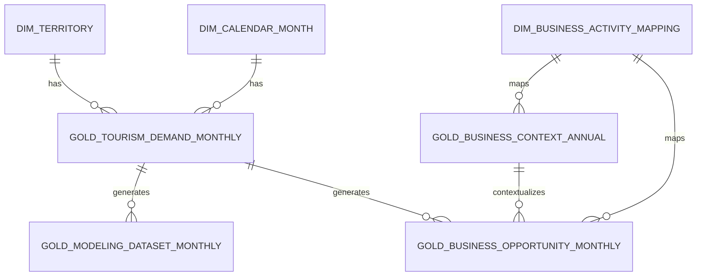

# Entrega 3 - Diseño del modelo de datos y capa gold del proyecto

## Trazabilidad del repositorio

Este documento corresponde al archivo `docs/entregas/03_modelo_datos.md`.

Tras el feedback recibido en la entrega anterior, el proyecto se acota definitivamente al sector de alojamientos de turismo rural y al ecosistema de microempresas locales vinculadas a esta demanda. Esta decisión permite trabajar con fuentes oficiales españolas y reduce el riesgo de entrenar modelos con datos no representativos del usuario final. Por tanto, esta entrega no desarrolla una solución genérica para cualquier microempresa rural, sino un modelo de datos específico para anticipar demanda turística rural y traducirla en indicadores operativos útiles para alojamientos, restauración, comercio local, actividades y entidades de apoyo territorial.

Las entregas anteriores se mantienen en:

```text
docs/
└── entregas/
    ├── 01_ideas_producto.md
    ├── 02_datos_necesarios.md
    └── 03_modelo_datos.md
```

La entrega 3 toma como punto de partida la idea seleccionada y el análisis de datos necesarios definidos en `02_datos_necesarios.md`. El objetivo de este documento es convertir esa definición funcional en un modelo de datos claro, reproducible y preparado para las siguientes fases del proyecto: análisis exploratorio, modelado predictivo, generación de indicadores, dashboard y presentación de resultados.

---

# 1. Resumen de la idea y datos del proyecto

## 1.1. Idea seleccionada

El proyecto consiste en desarrollar un **sistema de analítica predictiva de demanda turística rural y estimación de oportunidades para microempresas locales**. La solución se orienta principalmente a alojamientos de turismo rural, pero también a negocios vinculados al flujo de visitantes de los territorios rurales: restaurantes, cafeterías, comercios de producto local, empresas de actividades, guías, transporte local, asociaciones empresariales y entidades públicas de apoyo al desarrollo territorial.

El problema que se quiere resolver es que muchas microempresas rurales planifican apertura, personal, compras, existencias, campañas, actividades y colaboraciones con información limitada. Aunque conocen su experiencia pasada, normalmente no disponen de una herramienta que les permita anticipar con suficiente rigor cuándo aumentará o disminuirá la demanda turística de su territorio, qué meses concentran más pernoctaciones, cuánto tiempo permanecen los visitantes o qué peso tiene la demanda nacional y extranjera.

La solución no pretende predecir la facturación exacta de un negocio concreto. El objetivo es transformar estadísticas oficiales dispersas en una capa de datos limpia y útil para estimar **demanda turística territorial**, **intensidad turística esperada** y **oportunidades relativas de actividad** para distintos tipos de negocios locales.

## 1.2. Solución que se quiere construir

El resultado esperado será una prueba de concepto basada en datos oficiales españoles. El MVP combinará:

- descarga y normalización de fuentes oficiales;
- análisis descriptivo de demanda turística rural;
- predicción mensual de una variable principal, preferiblemente pernoctaciones;
- comparación y segmentación de territorios según estacionalidad, ocupación y procedencia de viajeros;
- generación de indicadores de oportunidad para distintos negocios locales;
- dashboard o aplicación ligera para consultar evolución histórica, previsiones y recomendaciones.

La unidad analítica principal será:

> **territorio x mes**

La variable objetivo recomendada para el modelo predictivo será:

> **pernoctaciones mensuales por territorio**

Esta variable representa mejor la presencia turística total que el número de viajeros, porque incorpora tanto la afluencia como la duración de la estancia. Además, se relaciona de forma más directa con la oportunidad potencial para restauración, actividades, comercio local y otros servicios.

## 1.3. Fuentes de datos previstas

El proyecto utilizará únicamente fuentes oficiales españolas, documentadas y reutilizables. Las fuentes previstas son las siguientes:

| Fuente | Organismo/plataforma | Uso principal en el proyecto | Granularidad esperada |
|---|---|---|---|
| Encuesta de Ocupación en Alojamientos de Turismo Rural | INE / Dataestur | Fuente principal para demanda, oferta, ocupación y empleo | Mensual; nacional, comunidad autónoma, provincia, zona turística o punto turístico según disponibilidad |
| Índice de Precios de Alojamientos de Turismo Rural | INE | Variable contextual de evolución de precios | Mensual; nacional y comunidad autónoma según tabla |
| Turismo de residentes en España | INE / Dataestur | Contexto de viajes y gasto de residentes | Trimestral o anual; destino publicado |
| Gasto turístico de visitantes internacionales, EGATUR | INE / Dataestur | Contexto de gasto y perfil agregado de visitantes extranjeros | Mensual; destino principal publicado |
| Empresas activas asociadas a la actividad turística | INE / Dataestur | Contexto del tejido empresarial turístico | Anual; territorio y actividad publicados |
| Calendarios oficiales y/o AEMET OpenData | BOE, comunidades autónomas, AEMET | Enriquecimiento opcional para festivos, puentes o clima | Variable según fuente |

La fuente imprescindible es la **Encuesta de Ocupación en Alojamientos de Turismo Rural**. Si alguna fuente complementaria no pudiera integrarse con garantías metodológicas, el proyecto seguiría siendo viable con la fuente principal, sustituyendo las estimaciones económicas por indicadores no monetarios de intensidad turística y oportunidad relativa.

## 1.4. Información que aportará cada fuente

| Fuente | Información aportada | Papel en el modelo de datos |
|---|---|---|
| Ocupación rural | Viajeros, pernoctaciones, estancia media, establecimientos, plazas, grados de ocupación, personal ocupado, procedencia nacional/extranjera | Núcleo de la capa gold y base del modelo predictivo |
| Índice de precios rural | Índice de precios, tasas de variación, modalidad de alquiler, tarifa | Variable explicativa y contextual; no se interpretará como precio real en euros |
| Turismo de residentes | Duración, motivo, alojamiento, transporte, gasto total y categorías de gasto | Ponderación contextual para escenarios de oportunidad, no atribución directa de gasto local |
| EGATUR | Gasto de visitantes internacionales, país de residencia, motivo, alojamiento, destino principal | Contextualización de demanda extranjera cuando la granularidad sea compatible |
| Empresas turísticas | Empresas activas y unidades locales por actividad turística | Densidad empresarial y ratios de demanda respecto a oferta empresarial |
| Calendarios/clima opcional | Festivos, puentes, temperaturas o precipitación | Posibles variables explicativas para mejorar interpretación o predicción |

---

# 2. Tecnología o formato de almacenamiento elegido

## 2.1. Enfoque general

Se utilizará una combinación de formatos, manteniendo cada uno en la fase donde aporta más valor:

| Capa | Formato principal | Formato auxiliar | Justificación |
|---|---|---|---|
| Raw | XLSX, CSV o JSON original descargado de la fuente | Metadatos en CSV/JSON | Conserva los datos tal como se obtienen, permite trazabilidad y auditoría |
| Processed | Parquet | CSV opcional para inspección manual | Eficiente, tipado, reproducible y adecuado para series temporales tabulares |
| Gold | Parquet | CSV exportado para entrega o revisión | Capa final limpia, rápida de leer desde Python, notebooks, DuckDB o dashboard |
| Documentación | Markdown | YAML/JSON para metadatos técnicos | Fácil de versionar en Git y coherente con el repositorio del proyecto |

La decisión principal es usar **Parquet como formato canónico para las capas processed y gold**, manteniendo una copia de exportación en CSV cuando sea útil para revisión académica o para mostrar el contenido sin herramientas adicionales.

En este documento se utilizará de forma uniforme el término **processed** para identificar la capa de datos limpios e intermedios anterior a la capa gold. Todos los ficheros de esta capa seguirán, cuando corresponda, el prefijo técnico `processed_`, evitando utilizar denominaciones alternativas para mantener una nomenclatura única en todo el repositorio.

## 2.2. Justificación técnica

El volumen de datos previsto es moderado, pero el proyecto requiere buena trazabilidad, tipos de datos estables y facilidad para rehacer transformaciones. Parquet encaja bien por las siguientes razones:

- conserva tipos de datos mejor que CSV, especialmente fechas, enteros nulos y decimales;
- permite lecturas rápidas desde Python, pandas, Polars, DuckDB o herramientas de dashboard;
- reduce el tamaño frente a CSV;
- es adecuado para una arquitectura por capas sin necesidad de desplegar una base de datos compleja;
- facilita reconstruir el dataset final a partir de scripts reproducibles.

Los ficheros CSV se usarán como formato auxiliar cuando sea necesario revisar datos manualmente o entregar una muestra legible. No serán el formato maestro de las capas procesadas, porque en CSV es más fácil perder información de tipos, codificación, fechas, separadores decimales o valores nulos.

## 2.3. Uso de base de datos relacional

Para el MVP no se plantea una base de datos relacional como almacenamiento principal. El proyecto no necesita concurrencia, transacciones ni un volumen masivo de registros. Añadir PostgreSQL o MySQL aumentaría la complejidad sin aportar una ventaja clara para esta fase.

No obstante, se contempla el uso de **DuckDB** como motor de consulta local sobre ficheros Parquet, especialmente para:

- validar joins entre tablas;
- hacer consultas SQL reproducibles;
- generar vistas para el dashboard;
- comprobar claves, duplicados y agregaciones.

DuckDB no se considerará la fuente de verdad del proyecto. La fuente de verdad serán los ficheros versionados y regenerables de `data/gold/`.

## 2.4. Convenciones de almacenamiento

Las convenciones iniciales serán:

| Elemento | Convención |
|---|---|
| Codificación | UTF-8 |
| Nombres de columnas | `snake_case`, en inglés técnico para facilitar modelado |
| Separador CSV auxiliar | Coma, con decimal en punto cuando se exporte desde Python |
| Fechas mensuales | `YYYY-MM-01` como primer día del mes |
| Identificador mensual | `month_id` en formato `YYYY-MM` |
| Porcentajes publicados | Se almacenarán como porcentaje 0-100 y se nombrarán con sufijo `_pct` |
| Proporciones derivadas | Se almacenarán como 0-1 y se nombrarán con sufijo `_share` |
| Índices derivados | Escala 0-100 salvo que se indique otra cosa |
| Valores no disponibles | Nulos reales, no cadenas como `".."`, `""`, `"NA"` o `"No disponible"` |
| Datos provisionales | Campo explícito `data_status` o `is_provisional` cuando la fuente lo permita |
| Identificadores territoriales | `territory_id` estable y `source_territory_code` conservado |

## 2.5. Motivo por el que esta elección es realista

La elección es realista para un TFM o proyecto académico-profesional porque permite construir un pipeline completo sin depender de infraestructura externa. El flujo puede ejecutarse localmente o en un entorno de notebooks, es fácil de versionar y permite pasar de datos oficiales heterogéneos a una capa gold clara.

La combinación de Raw en formato original, Processed en Parquet y Gold en Parquet/CSV ofrece un equilibrio adecuado entre trazabilidad, simplicidad y capacidad analítica.

---

# 3. Estructura de capas de datos

## 3.1. Estructura general del repositorio

El estado actual del repositorio al cierre de esta fase es el siguiente:

```text
project-root/
├── app/
│   └── .gitkeep
├── data/
│   ├── raw/
│   │   ├── ine_ocupacion_rural/
│   │   │   ├── <timestamp>_ine_2073_demand_province.csv
│   │   │   └── <timestamp>_ine_2070_supply_province.csv
│   │   ├── ine_precios_rurales/
│   │   │   └── .gitkeep
│   │   ├── dataestur_etr/
│   │   │   └── .gitkeep
│   │   ├── dataestur_egatur/
│   │   │   └── .gitkeep
│   │   ├── dataestur_empresas_turisticas/
│   │   │   └── .gitkeep
│   │   └── external_optional/
│   │       └── .gitkeep
│   ├── processed/
│   │   ├── processed_ocupacion_rural_demand_province_monthly.parquet
│   │   ├── processed_ocupacion_rural_supply_province_monthly.parquet
│   │   ├── processed_ocupacion_rural_monthly.parquet
│   │   ├── dim_calendar_month.parquet
│   │   └── dim_territory.parquet
│   ├── gold/
│   │   ├── gold_tourism_demand_monthly.parquet
│   │   └── exports_csv/
│   │       └── gold_tourism_demand_monthly.csv
│   └── metadata/
│       ├── data_sources.yml
│       ├── download_log.csv
│       ├── schema_gold.yml
│       ├── validation_rules.yml
│       ├── missing_territory_months.csv
│       └── data_quality_report.md
├── docs/
│   └── entregas/
│       ├── 01_ideas_producto.md
│       ├── 02_datos_necesarios.md
│       └── 03_modelo_datos.md
├── notebooks/
│   └── 01_data_exploration.ipynb
├── reports/
│   └── figures/
│       └── .gitkeep
├── src/
│   ├── data/
│   │   ├── download_sources.py
│   │   ├── normalize_sources.py
│   │   ├── build_dimensions.py
│   │   ├── build_gold.py
│   │   └── validate_gold.py
│   ├── features/
│   │   └── .gitkeep
│   ├── models/
│   │   └── .gitkeep
│   └── visualization/
│       └── .gitkeep
├── .gitignore
├── README.md
└── requirements.txt
```

Esta estructura representa los elementos implementados hasta el momento. Los datasets de modelado, contexto empresarial y oportunidad de negocio, así como los módulos de features, modelos y visualización, se incorporarán progresivamente en las siguientes fases. Las carpetas previstas para fases futuras se conservan mediante archivos `.gitkeep`, sin incluir todavía scripts, modelos o datasets ficticios.

## 3.2. Capa raw

La capa raw contendrá los ficheros descargados de las fuentes oficiales sin modificaciones analíticas. Solo se permitirán transformaciones mínimas necesarias para guardar el archivo, como renombrar el fichero de forma trazable o comprimirlo.

Estado actual y fuentes previstas:

| Carpeta | Estado | Contenido |
|---|---|---|
| `data/raw/ine_ocupacion_rural/` | Implementada | CSV oficiales completos de las tablas INE `2073`, demanda provincial, y `2070`, oferta, ocupación y empleo provincial |
| `data/raw/ine_precios_rurales/` | Pendiente | Índice de Precios de Alojamientos de Turismo Rural, previsto como contexto autonómico |
| `data/raw/dataestur_etr/` | Contextual y desactivada | Turismo de residentes, condicionado por su granularidad y frecuencia de publicación |
| `data/raw/dataestur_egatur/` | Contextual y desactivada | Gasto turístico internacional, sin distribución artificial entre provincias |
| `data/raw/dataestur_empresas_turisticas/` | Contextual y desactivada | Empresas activas asociadas al turismo, con frecuencia anual |
| `data/raw/external_optional/` | Opcional | Calendarios oficiales, festivos o climatología de AEMET |

Cada descarga se registra automáticamente en `data/metadata/download_log.csv`. El registro conserva el histórico de ejecuciones e incluye, al menos, los siguientes campos:

| Campo | Descripción |
|---|---|
| `download_id` | Identificador único de la descarga |
| `download_date` | Fecha en la que se descargó el fichero |
| `source_name` | Nombre de la fuente |
| `source_url_or_endpoint` | URL, endpoint o referencia de origen |
| `raw_file_path` | Ruta del fichero raw dentro del repositorio |
| `file_format` | XLSX, CSV, JSON u otro |
| `parameters` | Parámetros usados en la consulta si aplica |
| `file_hash` | Hash del fichero original para comprobar integridad |
| `notes` | Observaciones sobre descarga, provisionalidad o incidencias |

## 3.3. Capa processed

La capa processed contendrá datos limpios y normalizados, pero todavía próximos a cada fuente. Su objetivo es facilitar la integración posterior sin perder trazabilidad.

Transformaciones típicas de esta capa:

- normalización de nombres de columnas;
- conversión de fechas y periodos;
- conversión de números con separador decimal español;
- eliminación de filas vacías, notas o cabeceras repetidas;
- paso de formato ancho a formato largo cuando proceda;
- separación de variables como territorio, procedencia, métrica y periodo;
- conservación de códigos originales de fuente;
- creación de identificadores normalizados.

Datasets implementados y previstos:

| Dataset processed | Estado | Descripción | Granularidad |
|---|---|---|---|
| `processed_ocupacion_rural_demand_province_monthly.parquet` | Implementado | Viajeros y pernoctaciones provinciales normalizados desde la tabla INE `2073` | Provincia x mes x métrica x residencia |
| `processed_ocupacion_rural_supply_province_monthly.parquet` | Implementado | Establecimientos, plazas, ocupación y personal normalizados desde la tabla INE `2070` | Provincia x mes x métrica |
| `processed_ocupacion_rural_monthly.parquet` | Implementado | Unión en esquema común de las dos fuentes provinciales | Provincia x mes x métrica x residencia cuando aplica |
| `dim_calendar_month.parquet` | Implementado | Dimensión mensual continua con año, mes, trimestre, estación y periodos especiales | Mes |
| `dim_territory.parquet` | Implementado | Catálogo de 50 provincias y su correspondencia con comunidades autónomas | Provincia |
| `processed_precios_rurales_monthly.parquet` | Pendiente | Índice de precios rural normalizado | Comunidad autónoma x mes |
| `processed_etr_residentes.parquet` | Ampliación contextual | Turismo de residentes y gasto contextual | Destino publicado x periodo |
| `processed_egatur_monthly.parquet` | Ampliación contextual | Gasto turístico internacional | Destino publicado x mes |
| `processed_empresas_turisticas_annual.parquet` | Ampliación contextual | Empresas activas asociadas al turismo | Territorio x año x actividad |
| `dim_business_activity_mapping.parquet` | Pendiente | Correspondencia entre actividades oficiales y tipos de negocio | Actividad oficial x tipo de negocio |

La capa processed conserva tablas separadas por fuente y granularidad, además de un dataset combinado con esquema común. Esta separación permite reconstruir la capa gold sin perder la procedencia de cada métrica. Las fuentes contextuales se incorporarán únicamente cuando exista compatibilidad territorial y temporal suficiente.

## 3.4. Capa gold

La capa gold será el conjunto de datasets finales, limpios y preparados para consumo analítico. Debe permitir responder a las preguntas del proyecto sin volver a interpretar ficheros originales ni rehacer manualmente cruces entre fuentes.

El diseño completo prevé cuatro datasets gold. En esta fase se ha implementado y validado el núcleo descriptivo `gold_tourism_demand_monthly.parquet`; los otros tres datasets corresponden a fases posteriores de modelado, contexto empresarial y recomendaciones.

| Dataset gold | Estado | Función principal | Consumidor posterior |
|---|---|---|---|
| `gold_tourism_demand_monthly.parquet` | Implementado | Tabla principal de demanda, oferta, ocupación, procedencia e indicadores derivados por provincia y mes | EDA, validación, dashboard, segmentación y construcción de features |
| `gold_modeling_dataset_monthly.parquet` | Siguiente fase | Dataset temporal sin fuga de información para predecir pernoctaciones | Modelos predictivos y backtesting |
| `gold_business_context_annual.parquet` | Ampliación | Contexto anual del tejido empresarial turístico | Indicadores de densidad empresarial |
| `gold_business_opportunity_monthly.parquet` | Ampliación | Indicadores de oportunidad por territorio, mes y tipo de negocio | Dashboard y recomendaciones explicables |

Además, se mantendrán dimensiones auxiliares en gold o processed según convenga:

| Dataset auxiliar | Función |
|---|---|
| `dim_territory.parquet` | Homogeneizar nombres, códigos y niveles territoriales |
| `dim_calendar_month.parquet` | Gestionar año, mes, trimestre, temporada, festivos y periodos especiales |
| `dim_business_activity_mapping.parquet` | Relacionar códigos o categorías oficiales de actividad con `business_activity_group` y `business_type` |

## 3.5. Flujo completo de datos

El flujo lógico será:

```text
Fuentes oficiales
      │
      ▼
Capa raw
Ficheros originales descargados y versionados
      │
      ▼
Capa processed
Limpieza básica, normalización de columnas, fechas, territorios y métricas
      │
      ▼
Capa gold
Datasets finales: demanda mensual, dataset de modelado, contexto empresarial e indicadores
      │
      ▼
Consumo
EDA, modelos predictivos, segmentación, dashboard y recomendaciones explicables
```

Esta estructura evita trabajar con ficheros sueltos o transformaciones improvisadas. Cada fase tiene una función clara y puede reconstruirse desde la anterior.

---

# 4. Definición de la capa gold

## 4.1. Principios de diseño de la capa gold

La capa gold se define como el contrato de datos del proyecto. Sus principios serán:

1. **Una fila debe tener una interpretación inequívoca.** La tabla principal tendrá una fila por territorio y mes.
2. **No se mezclarán granularidades sin indicarlo.** Cualquier dato anual, trimestral o territorialmente más agregado incorporado a una tabla mensual llevará campos de control específicos por fuente, como `demand_source_frequency`, `price_source_frequency`, `spend_context_frequency`, `business_context_frequency`, `price_territory_level`, `spend_context_territory_level` o `business_context_territory_level`.
3. **No se fingirá precisión territorial.** Si una variable solo está disponible por comunidad autónoma, no se presentará como dato propio de una provincia o municipio.
4. **No se duplicarán totales.** Las filas de España, comunidad autónoma, provincia, zona turística y punto turístico se tratarán como niveles alternativos, no como elementos sumables entre sí.
5. **El dataset de modelado evitará fuga de información.** Las variables predictoras deberán estar disponibles antes del periodo predicho o construirse con lags históricos.
6. **Las variables de oportunidad serán índices o escenarios, no beneficios previstos.** No se calculará facturación ni beneficio neto de negocios concretos.
7. **Todas las transformaciones serán trazables.** Cada dataset gold deberá poder regenerarse desde raw y processed mediante scripts documentados.
8. **Cada ejecución tendrá versión de datos.** Las tablas gold incorporarán `source_snapshot_id`, `pipeline_run_id` o `data_version` para saber con qué descarga y ejecución se generó cada registro o dataset.

## 4.2. Resumen de datasets gold

| Dataset gold | Descripción funcional | Nivel de granularidad | Volumen o estado | Clave principal | Uso posterior |
|---|---|---|---|---|---|
| `gold_tourism_demand_monthly.parquet` | Demanda, oferta, ocupación, procedencia e indicadores turísticos | Una fila por `territory_id` x `month_id` | Implementado: 12.691 filas y 64 columnas | `territory_id`, `month_id` | EDA, validación, dashboard, segmentación y features |
| `gold_modeling_dataset_monthly.parquet` | Dataset preparado para predecir pernoctaciones mediante variables temporales y lags | Una fila por `territory_id` x `target_month_id` x `forecast_horizon` | Pendiente de construcción | `territory_id`, `target_month_id`, `forecast_horizon` | Modelos, validación temporal y backtesting |
| `gold_business_context_annual.parquet` | Contexto anual del tejido empresarial turístico | Una fila por `territory_id` x `year` x `business_activity_group` | Ampliación futura | `territory_id`, `year`, `business_activity_group` | Ratios de demanda y contexto empresarial |
| `gold_business_opportunity_monthly.parquet` | Indicadores de oportunidad por territorio y tipo de negocio | Una fila por `territory_id` x `month_id` x `business_type` | Ampliación futura | `territory_id`, `month_id`, `business_type` | Dashboard y recomendaciones |

Para asegurar la viabilidad durante el curso, la capa gold se priorizará en dos niveles:

| Nivel | Dataset | Prioridad | Motivo |
|---|---|---|---|
| Núcleo obligatorio | `gold_tourism_demand_monthly.parquet` | Alta | Contiene la demanda turística rural mensual y permite análisis, dashboard y segmentación. |
| Núcleo obligatorio | `gold_modeling_dataset_monthly.parquet` | Alta | Permite entrenar y validar el modelo predictivo de pernoctaciones u ocupación. |
| Ampliación deseable | `gold_business_context_annual.parquet` | Media | Enriquece el análisis con tejido empresarial turístico, pero no es imprescindible para predecir demanda. |
| Ampliación deseable | `gold_business_opportunity_monthly.parquet` | Media | Traduce la demanda en recomendaciones por tipo de negocio; puede simplificarse si las fuentes complementarias no encajan. |

De esta forma, el proyecto mantiene una versión mínima viable aunque las fuentes complementarias de gasto o empresas no puedan integrarse con la calidad suficiente.

## 4.3. Dataset `gold_tourism_demand_monthly.parquet`

### Descripción funcional

Es el dataset principal implementado en esta fase. Integra los datos mensuales provinciales de demanda y oferta turística rural con las dimensiones de calendario y territorio, la procedencia de viajeros, la capacidad, la ocupación, el empleo y distintos indicadores derivados.

La versión actual contiene **12.691 registros y 64 columnas**, cubre **50 provincias** y comprende el periodo entre **enero de 2005 y mayo de 2026**. La clave `territory_id + month_id` no presenta duplicados. Los **600 registros comprendidos entre junio de 2025 y mayo de 2026** están marcados como provisionales.

Los campos previstos para precios, gasto y contexto empresarial se mantienen como nulos reales hasta que se integren fuentes compatibles. No se inventan valores ni se asignan datos autonómicos como si fueran observaciones provinciales.

Esta tabla sirve para análisis descriptivo, validación, comparación territorial, segmentación, visualización y construcción de variables para el posterior dataset de modelado.

### Granularidad

> Una fila por **territorio x mes**.

Ejemplo:

```text
territory_id = ES-PROV-24
territory_name = León
territory_level = province
month_id = 2024-08
```

La fila representaría la situación mensual agregada de turismo rural para la provincia de León en agosto de 2024, no un establecimiento concreto ni un municipio concreto.

### Clave primaria

```text
territory_id + month_id
```

`territory_id` incluirá el nivel territorial para evitar colisiones entre códigos de distintos niveles.

### Campos principales

| Campo | Tipo esperado | Descripción | Fuente principal | Obligatorio |
|---|---|---|---|---|
| `territory_id` | string | Identificador normalizado del territorio | Derivado | Sí |
| `source_territory_code` | string | Código o etiqueta original de la fuente | INE/Dataestur | Sí |
| `territory_name` | string | Nombre legible del territorio | INE/Dataestur | Sí |
| `territory_level` | string | Nivel territorial real de la observación; en la versión implementada, únicamente `province` | Derivado | Sí |
| `autonomous_community_id` | string | Código de comunidad autónoma asociada cuando aplique | Derivado | Deseable |
| `province_id` | string | Código de provincia asociada cuando aplique | Derivado | Deseable |
| `month_id` | string | Periodo mensual en formato `YYYY-MM` | Derivado | Sí |
| `date_month` | date | Primer día del mes | Derivado | Sí |
| `year` | int16 | Año | Derivado | Sí |
| `month` | int8 | Mes numérico | Derivado | Sí |
| `quarter` | int8 | Trimestre | Derivado | Sí |
| `season` | string | Estación meteorológica aproximada: `winter`, `spring`, `summer` o `autumn` | Derivado | Deseable |
| `travellers_total` | int64 nullable | Viajeros totales | Ocupación rural | Sí |
| `travellers_domestic` | int64 nullable | Viajeros residentes en España | Ocupación rural | Deseable |
| `travellers_foreign` | int64 nullable | Viajeros residentes en el extranjero | Ocupación rural | Deseable |
| `overnight_stays_total` | int64 nullable | Pernoctaciones totales | Ocupación rural | Sí |
| `overnight_stays_domestic` | int64 nullable | Pernoctaciones de residentes en España | Ocupación rural | Deseable |
| `overnight_stays_foreign` | int64 nullable | Pernoctaciones de residentes en el extranjero | Ocupación rural | Deseable |
| `average_stay` | float64 | Estancia media | Ocupación rural | Sí |
| `establishments_estimated` | float64 nullable | Establecimientos abiertos estimados | Ocupación rural | Sí |
| `places_estimated` | float64 nullable | Plazas estimadas | Ocupación rural | Sí |
| `occupancy_rate_pct` | float64 | Grado de ocupación por plazas, escala 0-100 | Ocupación rural | Sí |
| `weekend_occupancy_rate_pct` | float64 | Grado de ocupación por plazas en fin de semana, escala 0-100 | Ocupación rural | Sí |
| `room_occupancy_rate_pct` | float64 | Grado de ocupación por habitaciones, si existe | Ocupación rural | Deseable |
| `staff_employed` | float64 nullable | Personal ocupado | Ocupación rural | Deseable |
| `price_index` | float64 nullable | Índice de precios de alojamientos rurales | INE precios | Deseable |
| `price_yoy_change_pct` | float64 nullable | Variación interanual del índice de precios | INE precios / derivado | Deseable |
| `domestic_travellers_share` | float64 nullable | Peso de viajeros residentes en España sobre viajeros totales, escala 0-1 | Derivado | Deseable |
| `foreign_travellers_share` | float64 nullable | Peso de viajeros extranjeros sobre viajeros totales, escala 0-1 | Derivado | Deseable |
| `domestic_overnight_stays_share` | float64 nullable | Peso de pernoctaciones de residentes en España sobre pernoctaciones totales, escala 0-1 | Derivado | Deseable |
| `foreign_overnight_stays_share` | float64 nullable | Peso de pernoctaciones de extranjeros sobre pernoctaciones totales, escala 0-1 | Derivado | Deseable |
| `overnight_stays_per_place` | float64 nullable | Pernoctaciones por plaza estimada | Derivado | Deseable |
| `travellers_per_establishment` | float64 nullable | Viajeros por establecimiento estimado | Derivado | Deseable |
| `tourism_pressure_index` | float64 nullable | Índice 0-100 de presión turística relativa | Derivado | Deseable |
| `seasonality_index` | float64 nullable | Índice de estacionalidad territorial | Derivado | Deseable |
| `covid_period` | bool | Indicador de meses afectados por COVID-19; regla inicial: `true` entre 2020-03 y 2021-12 | Derivado | Sí |
| `data_status` | string | Valores permitidos: `final_or_not_marked_provisional`, `provisional` o `unknown` | Fuente/metadatos | Deseable |
| `demand_source_frequency` | string | Frecuencia de la fuente principal de ocupación, normalmente mensual | Derivado | Sí |
| `price_source_frequency` | string nullable | Frecuencia del índice de precios incorporado | Derivado | Deseable |
| `price_territory_level` | string nullable | Nivel territorial real del dato de precios | Derivado | Deseable |
| `spend_context_frequency` | string nullable | Frecuencia del dato de gasto usado como contexto | Derivado | Opcional |
| `spend_context_territory_level` | string nullable | Nivel territorial real del dato de gasto contextual | Derivado | Opcional |
| `business_context_frequency` | string nullable | Frecuencia del dato empresarial usado como contexto, normalmente anual | Derivado | Opcional |
| `business_context_territory_level` | string nullable | Nivel territorial real del dato empresarial contextual | Derivado | Opcional |
| `source_snapshot_id` | string | Identificador de la descarga o conjunto raw utilizado | Metadatos | Sí |
| `pipeline_run_id` | string | Identificador de la ejecución del pipeline que genera el dataset | Pipeline | Sí |
| `data_version` | string | Versión lógica del dataset gold | Pipeline | Sí |
| `created_at` | datetime | Fecha de generación del dataset gold | Pipeline | Sí |

### Variables especialmente relevantes

- Variable objetivo principal candidata: `overnight_stays_total`.
- Variable objetivo secundaria candidata: `occupancy_rate_pct`.
- Variables descriptivas clave: `travellers_total`, `average_stay`, `places_estimated`, `weekend_occupancy_rate_pct`, `domestic_travellers_share`, `foreign_travellers_share`, `domestic_overnight_stays_share`, `foreign_overnight_stays_share`.
- Variables para indicadores de oportunidad: `tourism_pressure_index`, `seasonality_index`, `overnight_stays_per_place`, `price_index`.

### Uso posterior

Este dataset será consumido por:

- análisis exploratorio;
- dashboard descriptivo;
- comparación territorial;
- segmentación de territorios;
- construcción de features para el modelo;
- validación de coherencia de la capa gold.

## 4.4. Dataset `gold_modeling_dataset_monthly.parquet`

### Descripción funcional

Será el dataset específico para entrenamiento y validación de modelos predictivos. No será simplemente una copia de la tabla descriptiva. Su diferencia principal es que solo incluirá como variables predictoras aquellas que estén disponibles antes del mes a predecir o que se hayan construido con información histórica.

Esta separación es importante para evitar fuga de información. Por ejemplo, si se quiere predecir las pernoctaciones de agosto, no se debe usar como predictor el grado de ocupación real de agosto, porque ese valor solo se conoce después de que haya ocurrido el mes.

### Granularidad

> Una fila por **territorio x mes objetivo x horizonte de predicción**.

Para el MVP se trabajará inicialmente con horizonte mensual:

```text
forecast_horizon = 1
```

Esto significa que la fila contiene información disponible hasta el mes anterior para predecir el mes objetivo.

### Clave primaria

```text
territory_id + target_month_id + forecast_horizon
```

### Campos principales

| Campo | Tipo esperado | Descripción | Uso |
|---|---|---|---|
| `territory_id` | string | Identificador del territorio | Clave |
| `territory_level` | string | Nivel territorial | Segmentación/modelo |
| `target_month_id` | string | Mes que se quiere predecir | Clave temporal |
| `target_date_month` | date | Fecha mensual objetivo | Clave temporal |
| `forecast_horizon` | int8 | Horizonte de predicción en meses | Clave/modelo |
| `target_overnight_stays_total` | int64 nullable | Pernoctaciones del mes objetivo | Variable objetivo principal |
| `target_occupancy_rate_pct` | float64 nullable | Ocupación real del mes objetivo | Objetivo secundario o evaluación |
| `year` | int16 | Año del mes objetivo | Feature calendario |
| `month` | int8 | Mes del año | Feature calendario |
| `quarter` | int8 | Trimestre | Feature calendario |
| `is_summer` | bool | Indicador junio-septiembre o temporada definida | Feature calendario |
| `is_easter_period` | bool nullable | Indicador aproximado Semana Santa, si se integra calendario | Feature opcional |
| `covid_period` | bool | Indicador de periodo COVID | Control de ruptura |
| `lag_1_overnight_stays` | float64 nullable | Pernoctaciones del mes anterior | Feature temporal |
| `lag_3_overnight_stays` | float64 nullable | Pernoctaciones de tres meses antes | Feature temporal |
| `lag_12_overnight_stays` | float64 nullable | Pernoctaciones del mismo mes del año anterior | Feature estacional |
| `rolling_mean_3m_overnight_stays` | float64 nullable | Media móvil de 3 meses anteriores | Feature temporal |
| `rolling_mean_12m_overnight_stays` | float64 nullable | Media móvil de 12 meses anteriores | Feature temporal |
| `yoy_change_overnight_stays` | float64 nullable | Variación interanual histórica disponible | Feature temporal |
| `lag_1_occupancy_rate_pct` | float64 nullable | Ocupación del mes anterior | Feature temporal |
| `lag_12_occupancy_rate_pct` | float64 nullable | Ocupación del mismo mes del año anterior | Feature estacional |
| `lag_1_average_stay` | float64 nullable | Estancia media del mes anterior | Feature temporal |
| `lag_12_average_stay` | float64 nullable | Estancia media del mismo mes año anterior | Feature estacional |
| `price_index_lag_1` | float64 nullable | Índice de precios del mes anterior o último disponible | Feature contextual |
| `domestic_travellers_share_lag_1` | float64 nullable | Peso de viajeros nacionales del mes anterior | Feature demanda |
| `foreign_travellers_share_lag_1` | float64 nullable | Peso de viajeros extranjeros del mes anterior | Feature demanda |
| `domestic_overnight_stays_share_lag_1` | float64 nullable | Peso de pernoctaciones nacionales del mes anterior | Feature demanda |
| `foreign_overnight_stays_share_lag_1` | float64 nullable | Peso de pernoctaciones extranjeras del mes anterior | Feature demanda |
| `business_density_annual` | float64 nullable | Densidad empresarial anual aplicable al territorio | Feature contextual |
| `train_validation_split` | string | Train, validation, test o backtest_fold | Control de evaluación |
| `data_quality_flag` | string | OK, missing_target, insufficient_history, outlier_review | Control de calidad |
| `source_snapshot_id` | string | Identificador de descarga utilizada | Trazabilidad |
| `pipeline_run_id` | string | Identificador de ejecución del pipeline | Trazabilidad |
| `data_version` | string | Versión lógica del dataset gold | Trazabilidad |

### Variables especialmente relevantes

- Objetivo principal: `target_overnight_stays_total`.
- Baseline principal: `lag_12_overnight_stays`.
- Features clave: `month`, `lag_1_overnight_stays`, `lag_12_overnight_stays`, `rolling_mean_12m_overnight_stays`, `price_index_lag_1`, `domestic_travellers_share_lag_1`, `domestic_overnight_stays_share_lag_1`, `covid_period`.

### Uso posterior

Este dataset será consumido por:

- modelos baseline;
- modelos supervisados;
- validación temporal;
- comparación de rendimiento frente al mismo mes del año anterior;
- análisis de errores por territorio y temporada.

## 4.5. Dataset `gold_business_context_annual.parquet`

### Descripción funcional

Este dataset recogerá el contexto anual del tejido empresarial turístico. No representará ventas ni capacidad individual de empresas, sino presencia agregada de actividades económicas relacionadas con el turismo.

Permitirá calcular ratios como pernoctaciones por empresa turística, intensidad de demanda respecto a número de empresas de restauración o posible concentración de actividades complementarias.

### Granularidad

> Una fila por **territorio x año x grupo de actividad empresarial turística**.

Ejemplo:

```text
territory_id = ES-PROV-24
year = 2023
business_activity_group = food_and_beverage
```

### Clave primaria

```text
territory_id + year + business_activity_group
```

### Campos principales

| Campo | Tipo esperado | Descripción | Fuente | Obligatorio |
|---|---|---|---|---|
| `territory_id` | string | Identificador normalizado del territorio | Derivado | Sí |
| `territory_name` | string | Nombre del territorio | Fuente/derivado | Sí |
| `territory_level` | string | Nivel territorial | Derivado | Sí |
| `year` | int16 | Año | Fuente | Sí |
| `business_activity_group` | string | Grupo interpretativo: alojamiento, restauración, transporte, actividades, cultura, agencias, otros | Derivado | Sí |
| `source_activity_code` | string | Código CNAE o categoría original si está disponible | Fuente | Deseable |
| `source_activity_name` | string | Nombre original de la actividad | Fuente | Sí |
| `mapping_confidence` | string | Confianza del mapeo entre actividad oficial y grupo interpretativo | Derivado | Deseable |
| `active_companies` | int64 nullable | Empresas activas | Empresas turísticas | Sí |
| `local_units` | int64 nullable | Unidades locales, si existe | Empresas turísticas | Deseable |
| `business_density_per_1000_stays` | float64 nullable | Empresas por cada 1.000 pernoctaciones anuales | Derivado | Deseable |
| `overnight_stays_per_business` | float64 nullable | Pernoctaciones anuales por empresa activa | Derivado | Deseable |
| `data_status` | string | Estado del dato | Fuente/metadatos | Deseable |
| `source_snapshot_id` | string | Identificador de descarga utilizada | Metadatos | Sí |
| `pipeline_run_id` | string | Identificador de ejecución del pipeline | Pipeline | Sí |
| `data_version` | string | Versión lógica del dataset gold | Pipeline | Sí |
| `created_at` | datetime | Fecha de generación | Pipeline | Sí |

### Uso posterior

Este dataset será consumido por:

- indicadores de oportunidad económica relativa;
- segmentación de territorios por tejido empresarial;
- recomendaciones para tipos de negocio;
- análisis del equilibrio entre demanda turística y oferta empresarial agregada.

## 4.6. Dataset `gold_business_opportunity_monthly.parquet`

### Descripción funcional

Este dataset traducirá la demanda turística prevista o histórica en indicadores de oportunidad para distintos tipos de negocio. No calculará ingresos reales ni beneficios. Su objetivo será proporcionar una lectura operativa y explicable de la intensidad turística.

Cada fila combinará un territorio, un mes y un tipo de negocio. Por ejemplo:

```text
territory_id = ES-PROV-24
month_id = 2024-08
business_type = restaurants
```

La fila indicará si agosto de 2024 presenta una presión de demanda alta, media o baja para restauración, qué variables justifican esa clasificación y qué recomendación operativa se podría mostrar.

### Granularidad

> Una fila por **territorio x mes x tipo de negocio**.

### Clave primaria

```text
territory_id + month_id + business_type
```

### Tipos de negocio iniciales

| `business_type` | Interpretación |
|---|---|
| `rural_accommodation` | Alojamientos rurales |
| `restaurants` | Restaurantes, cafeterías y bares |
| `local_food_retail` | Comercio de producto local |
| `activities_experiences` | Empresas de actividades, experiencias, cultura, deporte y naturaleza |
| `local_transport_guides` | Transporte local, guías y servicios de movilidad |
| `tourism_association_public_support` | Asociaciones, oficinas de turismo o entidades de apoyo |

### Campos principales

| Campo | Tipo esperado | Descripción | Fuente/derivado | Obligatorio |
|---|---|---|---|---|
| `territory_id` | string | Identificador del territorio | Derivado | Sí |
| `month_id` | string | Mes | Derivado | Sí |
| `business_type` | string | Tipo de negocio o entidad | Derivado | Sí |
| `business_activity_group` | string nullable | Grupo de actividad empresarial asociado, cuando exista correspondencia | Derivado | Deseable |
| `expected_demand_level` | string | Baja, media, alta o muy alta | Derivado | Sí |
| `tourism_pressure_index` | float64 | Índice de presión turística 0-100 | Derivado | Sí |
| `business_opportunity_index` | float64 | Índice de oportunidad 0-100 por tipo de negocio | Derivado | Sí |
| `seasonality_index` | float64 nullable | Intensidad estacional del territorio | Derivado | Deseable |
| `weekend_dependence_index` | float64 nullable | Diferencia relativa entre ocupación de fin de semana y ocupación mensual | Derivado | Deseable |
| `average_stay_signal` | string | Baja, normal o alta según estancia media | Derivado | Deseable |
| `domestic_demand_signal` | string | Dependencia baja, media o alta de demanda nacional | Derivado | Deseable |
| `foreign_demand_signal` | string | Dependencia baja, media o alta de demanda extranjera | Derivado | Deseable |
| `business_density_signal` | string | Baja, media o alta densidad empresarial asociada | Derivado | Deseable |
| `forecast_value` | float64 nullable | Predicción de pernoctaciones u ocupación si ya existe modelo | Modelo | Deseable |
| `forecast_interval_lower` | float64 nullable | Límite inferior de predicción | Modelo | Deseable |
| `forecast_interval_upper` | float64 nullable | Límite superior de predicción | Modelo | Deseable |
| `recommendation_text` | string | Recomendación explicable generada por reglas | Derivado | Sí |
| `recommendation_rationale` | string | Variables que justifican la recomendación | Derivado | Sí |
| `confidence_level` | string | Alta, media o baja según calidad e incertidumbre | Derivado | Sí |
| `source_snapshot_id` | string | Identificador de descarga utilizada | Metadatos | Sí |
| `pipeline_run_id` | string | Identificador de ejecución del pipeline | Pipeline | Sí |
| `data_version` | string | Versión lógica del dataset gold | Pipeline | Sí |
| `created_at` | datetime | Fecha de generación | Pipeline | Sí |

### Ejemplos de reglas explicables

| Condición | Tipo de negocio | Recomendación |
|---|---|---|
| `tourism_pressure_index` alto y `weekend_dependence_index` alto | Restauración | Reforzar turnos o reservas en viernes, sábado y domingo |
| `forecast_value` por encima de la media histórica y `average_stay_signal` alta | Actividades | Programar experiencias de media jornada o paquetes con alojamientos |
| `domestic_demand_signal` alta y demanda prevista baja | Alojamiento / comercio local | Activar campañas de escapadas de proximidad |
| Alta demanda y baja densidad de actividades | Actividades y entidades públicas | Señalar oportunidad relativa de colaboración o nuevas experiencias |
| Alta incertidumbre del modelo | Todos | Mostrar la recomendación como escenario, no como acción prioritaria |

### Uso posterior

Este dataset será consumido por:

- dashboard interactivo;
- módulo de recomendaciones;
- presentación final;
- explicación de oportunidades para microempresas rurales.

## 4.7. Dimensión `dim_territory.parquet`

### Descripción funcional

Tabla auxiliar para homogeneizar territorios entre fuentes. Es fundamental porque INE y Dataestur pueden publicar datos con distintos niveles y nombres territoriales.

### Granularidad

> Una fila por territorio normalizado.

### Campos previstos

| Campo | Tipo | Descripción |
|---|---|---|
| `territory_id` | string | Identificador normalizado único |
| `territory_name` | string | Nombre territorial utilizado por el modelo; en la versión actual coincide con el nombre provincial procedente de la fuente |
| `territory_level` | string | Nivel territorial real de la observación; en la versión implementada, únicamente `province` |
| `source_territory_code` | string | Código original de fuente si existe |
| `source_territory_name` | string | Nombre original de fuente |
| `autonomous_community_id` | string nullable | Comunidad autónoma asociada |
| `province_id` | string nullable | Provincia asociada |
| `is_rural_tourism_available` | bool | Indica si existe serie de ocupación rural |
| `first_available_month` | string nullable | Primer mes disponible en la fuente principal |
| `last_available_month` | string nullable | Último mes disponible en la fuente principal |
| `coverage_quality` | string | Alta, media, baja o insuficiente |

## 4.8. Dimensión `dim_business_activity_mapping.parquet`

### Descripción funcional

Tabla auxiliar para conectar las actividades oficiales de la fuente de empresas turísticas con los tipos de negocio utilizados en el dashboard y en las recomendaciones. Esta tabla evita una relación ambigua entre categorías estadísticas y recomendaciones operativas.

No todas las actividades oficiales se corresponden de forma perfecta con un único tipo de negocio. Por eso el mapeo será explícito, conservador y auditable.

### Granularidad

> Una fila por **actividad oficial x grupo normalizado x tipo de negocio**, aplicando una regla principal de asignación para el MVP.

### Campos previstos

| Campo | Tipo | Descripción |
|---|---|---|
| `source_activity_code` | string nullable | Código CNAE o código original de la actividad, si está disponible |
| `source_activity_name` | string | Nombre original de la actividad en la fuente |
| `business_activity_group` | string | Grupo empresarial normalizado: accommodation, food_and_beverage, transport, activities, culture, agencies, other |
| `business_type` | string | Tipo de negocio usado en recomendaciones: restaurants, local_food_retail, activities_experiences, etc. |
| `is_primary_mapping` | bool | Indica si es la asignación principal utilizada para evitar doble conteo |
| `mapping_confidence` | string | Alta, media o baja según claridad de la correspondencia |
| `mapping_rule` | string | Regla aplicada para justificar la asignación |
| `valid_from_year` | int16 nullable | Año inicial de validez si hay cambios de clasificación |
| `valid_to_year` | int16 nullable | Año final de validez si hay cambios de clasificación |

### Uso posterior

Esta dimensión se usará para:

- agrupar empresas activas en categorías interpretables;
- construir `gold_business_context_annual.parquet`;
- vincular densidad empresarial con `business_type` sin duplicar empresas;
- explicar las recomendaciones cuando una oportunidad se asocia a restauración, actividades, comercio local u otros servicios.

## 4.9. Dimensión `dim_calendar_month.parquet`

### Descripción funcional

Tabla auxiliar para facilitar series temporales, estacionalidad y validación temporal.

### Granularidad

> Una fila por mes.

### Campos previstos

| Campo | Tipo | Descripción |
|---|---|---|
| `month_id` | string | `YYYY-MM` |
| `date_month` | date | Primer día del mes |
| `year` | int16 | Año |
| `month` | int8 | Mes numérico |
| `month_name` | string | Nombre del mes |
| `quarter` | int8 | Trimestre |
| `season` | string | Temporada aproximada |
| `is_summer` | bool | Indicador temporada estival |
| `is_christmas_period` | bool | Indicador Navidad si procede |
| `is_easter_period` | bool nullable | Indicador Semana Santa si se integra |
| `covid_period` | bool | Indicador de meses afectados por COVID-19 |
| `complete_month_available` | bool | Indica si se espera dato mensual completo |

---

# 5. Relaciones entre datos

## 5.1. Modelo lógico resumido

El modelo de datos se puede entender como una estructura tipo estrella, con una tabla principal de hechos mensuales de turismo rural y dimensiones de tiempo y territorio.

```text
                           dim_calendar_month
                                  │
                                  │ 1:N
                                  ▼
 dim_territory ─── 1:N ─── gold_tourism_demand_monthly ─── N:1 ─── price_context
      │                              │
      │ 1:N                          │ 1:N
      ▼                              ▼
gold_business_context_annual    gold_business_opportunity_monthly
      ▲                              ▲
      │ N:1                          │ N:1
      └──────── dim_business_activity_mapping ────────┘
                                      │
                                      ▼
                              dashboard / recomendaciones
```

La tabla `gold_modeling_dataset_monthly` se construye a partir de `gold_tourism_demand_monthly`, pero con lags y variables preparadas específicamente para predicción.

Además, el modelo puede representarse de forma simplificada como:



## 5.2. Relaciones principales

| Relación | Claves | Cardinalidad | Uso |
|---|---|---|---|
| `dim_calendar_month` -> `gold_tourism_demand_monthly` | `month_id` | 1:N | Añadir año, mes, trimestre, temporada y periodos especiales |
| `dim_territory` -> `gold_tourism_demand_monthly` | `territory_id` | 1:N | Homogeneizar códigos, nombres y niveles territoriales |
| `gold_tourism_demand_monthly` -> `gold_modeling_dataset_monthly` | `territory_id`, `month_id` desplazado por lags | 1:N lógica | Crear dataset supervisado con históricos |
| `gold_tourism_demand_monthly` -> `gold_business_opportunity_monthly` | `territory_id`, `month_id` | 1:N | Generar una fila por tipo de negocio |
| `gold_business_context_annual` -> `gold_business_opportunity_monthly` | `territory_id`, `year`, `business_activity_group` | 1:N | Añadir densidad empresarial anual al indicador mensual |
| `dim_business_activity_mapping` -> `gold_business_context_annual` | `source_activity_code`, `source_activity_name` | 1:N | Normalizar actividades oficiales en grupos de actividad |
| `dim_business_activity_mapping` -> `gold_business_opportunity_monthly` | `business_type`, `business_activity_group` | 1:N | Vincular grupos empresariales con recomendaciones por tipo de negocio |
| Índice de precios -> `gold_tourism_demand_monthly` | `autonomous_community_id`, `month_id` o `territory_id`, `month_id` según nivel | 1:N o 1:1 | Añadir contexto de precios compatible |
| EGATUR -> `gold_tourism_demand_monthly` | `autonomous_community_id`, `month_id` cuando sea compatible | 1:N | Contextualizar demanda extranjera |
| Turismo residentes -> `gold_tourism_demand_monthly` | `territory_id` o destino compatible + trimestre/año | 1:N | Contextualizar gasto residente, sin precisión mensual artificial |

## 5.3. Claves de relación

### Clave temporal

La clave temporal principal será `month_id`, en formato `YYYY-MM`. Para fuentes trimestrales o anuales se crearán claves auxiliares:

| Campo | Ejemplo | Uso |
|---|---|---|
| `month_id` | `2024-08` | Tablas mensuales |
| `quarter_id` | `2024-Q3` | Fuentes trimestrales |
| `year` | `2024` | Fuentes anuales |

Cuando una fuente trimestral se incorpore a una tabla mensual, no se tratará como observación mensual real. Se marcará con campos como:

```text
spend_context_frequency = quarterly
context_temporal_assignment = repeated_within_quarter
```

Cuando una fuente anual se incorpore a una tabla mensual, se marcará con:

```text
business_context_frequency = annual
context_temporal_assignment = repeated_within_year
```

### Clave territorial

La clave territorial normalizada será `territory_id`. Se construirá evitando ambigüedades entre niveles:

```text
ESP_TOTAL
CCAA_07
ES-PROV-24
ZONE_<codigo_o_slug>
POINT_<codigo_o_slug>
```

Siempre se conservará también el nombre y código original de la fuente:

```text
source_territory_code
source_territory_name
```

Esto permitirá auditar cambios de nombres, acentos, códigos o agrupaciones.

## 5.4. Relaciones 1:1, 1:N y N:M

### Relaciones 1:1

Se esperan relaciones 1:1 cuando dos tablas comparten exactamente el mismo nivel territorial y temporal. Ejemplo:

```text
demanda rural comunidad autónoma + mes 1 --- 1 índice de precios comunidad autónoma + mes
```

Esta relación solo será 1:1 si ambas tablas publican el mismo territorio y el mismo mes.

### Relaciones 1:N

Serán las más frecuentes. Ejemplos:

```text
dim_territory.territory_id 1 --- N gold_tourism_demand_monthly.territory_id

dim_calendar_month.month_id 1 --- N gold_tourism_demand_monthly.month_id

gold_tourism_demand_monthly.territory_id + month_id 1 --- N gold_business_opportunity_monthly.territory_id + month_id
```

También habrá relaciones 1:N al asignar datos de comunidad autónoma a provincias como contexto, por ejemplo el índice de precios rural cuando no exista desglose provincial:

```text
precio CCAA + mes 1 --- N provincias de esa CCAA + mes
```

En este caso se deberá indicar que el dato es contextual autonómico, no provincial.

### Relaciones N:M

Las relaciones N:M se evitarán en la capa gold final. Pueden aparecer en la fase processed al trabajar con zonas turísticas que agrupan varios municipios o con actividades empresariales que se agrupan en categorías interpretativas.

Para resolverlas se usarán tablas puente cuando sea necesario:

```text
bridge_territory_hierarchy
dim_business_activity_mapping
```

Ejemplo:

```text
source_activity_code N --- M business_type
```

Se transformará en una relación controlada mediante una tabla de correspondencia, donde cada código de actividad se asignará a un grupo principal para el MVP. Si una actividad pudiera pertenecer a varios tipos de negocio, se documentará y se aplicará una regla conservadora para no duplicar indicadores.

## 5.5. Joins y agregaciones necesarias

| Cruce o agregación | Método previsto | Riesgo principal | Control |
|---|---|---|---|
| Ocupación rural + calendario | Join por `month_id` | Bajo | Validar que todos los meses existen en calendario |
| Ocupación rural + territorio | Join por `territory_id` | Nombres/códigos inconsistentes | Tabla `dim_territory` y validación de no emparejados |
| Ocupación rural + precios | Join por CCAA/mes o territorio/mes | Asignar datos autonómicos a provincias | Campo `price_territory_level` y uso contextual |
| Ocupación rural + empresas | Join por territorio/año | Repetición anual en meses | Campo `business_context_frequency = annual` |
| Ocupación rural + gasto residentes | Join por destino compatible y trimestre/año | Falsa precisión mensual o rural | Usar solo como ponderación contextual |
| Ocupación rural + EGATUR | Join por destino compatible y mes | Destino principal no equivalente a turismo rural | Usar solo para contexto de demanda extranjera |
| Métricas mensuales a anuales | Agrupación por territorio/año | Mezclar niveles territoriales | Agrupar solo dentro del mismo `territory_level` |
| Zonas/puntos turísticos a provincias | Tabla puente si existe composición | Composición territorial no estable | No forzar agregación si no está documentada |

## 5.6. Problemas esperados al combinar fuentes

Los principales problemas al combinar fuentes serán:

- diferencias de granularidad territorial: provincia, comunidad autónoma, zona turística o destino principal;
- diferencias de granularidad temporal: mensual, trimestral y anual;
- categorías de gasto no específicas de turismo rural;
- datos de precios que representan índices, no tarifas reales;
- empresas turísticas agregadas por actividad, sin capacidad ni ingresos;
- cambios en nombres de territorios o categorías entre tablas;
- posible falta de datos para puntos turísticos con poca muestra;
- riesgo de doble conteo si se suman niveles territoriales distintos.

La mitigación principal será mantener campos explícitos de nivel territorial, frecuencia de fuente y uso contextual. No se incorporará a la capa gold ninguna relación que obligue a simular una precisión inexistente.

---

# 6. Diccionario de datos inicial

Este diccionario recoge los campos principales que se espera utilizar en la capa gold. Podrá ampliarse durante la construcción real del pipeline, pero sirve como contrato inicial para análisis, modelado y dashboard.

## 6.1. Identificación, territorio y tiempo

| Campo | Descripción | Tipo de dato | Fuente | Obligatorio | Observaciones |
|---|---|---|---|---|---|
| `territory_id` | Identificador normalizado del territorio | string | Derivado | Sí | Clave principal junto con `month_id` |
| `source_territory_code` | Código o identificador original de la fuente | string | INE/Dataestur | Sí | Puede no existir en todas las descargas; se conservará si aparece |
| `source_territory_name` | Nombre original del territorio en la fuente | string | INE/Dataestur | Sí | Útil para trazabilidad |
| `territory_name` | Nombre legible del territorio utilizado en la capa gold | string | Derivado | Sí | En la versión actual coincide con el nombre provincial publicado por el INE tras eliminar espacios externos; no se aplica todavía un catálogo adicional de nombres canónicos |
| `territory_level` | Nivel territorial | string | Derivado | Sí | En la tabla gold implementada solo se admite `province`; los demás niveles quedan reservados para ampliaciones futuras en datasets separados o debidamente identificados. |
| `autonomous_community_id` | Comunidad autónoma asociada | string nullable | Derivado | Deseable | Necesario para cruzar precios o gasto autonómico |
| `province_id` | Provincia asociada | string nullable | Derivado | Deseable | Aplicable a provincias, zonas o puntos cuando sea posible |
| `month_id` | Identificador mensual | string | Derivado | Sí | Formato `YYYY-MM` |
| `date_month` | Fecha del primer día del mes | date | Derivado | Sí | Formato `YYYY-MM-01` |
| `year` | Año | int16 | Derivado | Sí | Extraído de `date_month` |
| `month` | Mes numérico | int8 | Derivado | Sí | 1-12 |
| `quarter` | Trimestre | int8 | Derivado | Sí | 1-4 |
| `season` | Estación meteorológica aproximada | string | Derivado | Deseable | Valores: `winter`, `spring`, `summer` o `autumn`; no representa todavía temporada turística alta o baja |
| `covid_period` | Indicador de periodo COVID-19 | bool | Derivado | Sí | Permitirá comparar modelos con y sin estos meses |

## 6.2. Variables de demanda turística rural

| Campo | Descripción | Tipo de dato | Fuente | Obligatorio | Observaciones |
|---|---|---|---|---|---|
| `travellers_total` | Viajeros totales alojados en turismo rural | int64 nullable | Ocupación rural | Sí | Métrica principal complementaria |
| `travellers_domestic` | Viajeros residentes en España | int64 nullable | Ocupación rural | Deseable | Puede depender de tabla disponible |
| `travellers_foreign` | Viajeros residentes en el extranjero | int64 nullable | Ocupación rural | Deseable | Puede depender de tabla disponible |
| `overnight_stays_total` | Pernoctaciones totales | int64 nullable | Ocupación rural | Sí | Variable objetivo recomendada |
| `overnight_stays_domestic` | Pernoctaciones de residentes en España | int64 nullable | Ocupación rural | Deseable | Útil para perfil de demanda |
| `overnight_stays_foreign` | Pernoctaciones de residentes en el extranjero | int64 nullable | Ocupación rural | Deseable | Útil para perfil de demanda |
| `average_stay` | Estancia media | float64 nullable | Ocupación rural | Sí | Relación entre pernoctaciones y viajeros |
| `domestic_travellers_share` | Peso de viajeros nacionales | float64 nullable | Derivado | Deseable | Valor 0-1; calculado sobre `travellers_total` |
| `foreign_travellers_share` | Peso de viajeros extranjeros | float64 nullable | Derivado | Deseable | Valor 0-1; calculado sobre `travellers_total` |
| `domestic_overnight_stays_share` | Peso de pernoctaciones nacionales | float64 nullable | Derivado | Deseable | Valor 0-1; calculado sobre `overnight_stays_total` |
| `foreign_overnight_stays_share` | Peso de pernoctaciones extranjeras | float64 nullable | Derivado | Deseable | Valor 0-1; calculado sobre `overnight_stays_total` |
| `overnight_stays_yoy_change_pct` | Variación interanual de las pernoctaciones | float64 nullable | Derivado | Deseable | Porcentaje respecto al mismo mes del año anterior |
| `overnight_stays_mom_change_pct` | Variación mensual de las pernoctaciones | float64 nullable | Derivado | Deseable | Porcentaje respecto al mes anterior; puede ser muy volátil en territorios pequeños |

## 6.3. Variables de oferta, ocupación y empleo

| Campo | Descripción | Tipo de dato | Fuente | Obligatorio | Observaciones |
|---|---|---|---|---|---|
| `establishments_estimated` | Establecimientos abiertos estimados | float64 nullable | Ocupación rural | Sí | Magnitud estimada; se conservará como decimal si la fuente lo publica así |
| `places_estimated` | Plazas estimadas | float64 nullable | Ocupación rural | Sí | Magnitud estimada; base para ratios de presión |
| `occupancy_rate_pct` | Grado de ocupación por plazas | float64 nullable | Ocupación rural | Sí | Porcentaje 0-100 |
| `weekend_occupancy_rate_pct` | Grado de ocupación por plazas en fin de semana | float64 nullable | Ocupación rural | Sí | Clave para recomendaciones de fines de semana |
| `room_occupancy_rate_pct` | Grado de ocupación por habitaciones | float64 nullable | Ocupación rural | Deseable | Puede no estar siempre disponible |
| `staff_employed` | Personal ocupado | float64 nullable | Ocupación rural | Deseable | Magnitud estimada; aproximación a necesidades operativas |
| `overnight_stays_per_place` | Pernoctaciones por plaza estimada | float64 nullable | Derivado | Deseable | Indicador de presión de demanda |
| `travellers_per_establishment` | Viajeros por establecimiento | float64 nullable | Derivado | Deseable | Indicador de intensidad respecto a alojamientos |
| `weekend_dependence_index` | Diferencia relativa entre ocupación fin de semana y ocupación mensual | float64 nullable | Derivado | Deseable | Útil para restaurantes y actividades |

## 6.4. Variables de precios, gasto y contexto empresarial

| Campo | Descripción | Tipo de dato | Fuente | Obligatorio | Observaciones |
|---|---|---|---|---|---|
| `demand_source_frequency` | Frecuencia del dato de demanda | string | Derivado | Sí | Normalmente mensual |
| `price_index` | Índice de precios de alojamientos rurales | float64 nullable | INE precios | Deseable | No equivale a precio real en euros |
| `price_yoy_change_pct` | Variación interanual del índice de precios | float64 nullable | INE precios/derivado | Deseable | Contexto de presión de precios |
| `price_source_frequency` | Frecuencia del dato de precios | string nullable | Derivado | Deseable | Normalmente mensual |
| `price_territory_level` | Nivel territorial del precio incorporado | string nullable | Derivado | Deseable | Evita presentar dato autonómico como provincial |
| `resident_avg_spend_context` | Gasto medio contextual de residentes | float64 nullable | Turismo residentes | Opcional | Solo como escenario, no gasto local real |
| `foreign_avg_spend_context` | Gasto medio contextual de extranjeros | float64 nullable | EGATUR | Opcional | Solo si la granularidad es compatible |
| `spend_context_frequency` | Frecuencia del dato de gasto | string nullable | Derivado | Opcional | Mensual, trimestral o anual |
| `spend_context_territory_level` | Nivel territorial real del gasto contextual | string nullable | Derivado | Opcional | Evita atribuir gasto autonómico a una provincia como dato propio |
| `business_context_frequency` | Frecuencia del dato empresarial | string nullable | Derivado | Opcional | Normalmente anual |
| `business_context_territory_level` | Nivel territorial real del contexto empresarial | string nullable | Derivado | Opcional | Provincia, comunidad u otro nivel publicado |
| `active_companies` | Empresas activas turísticas | int64 nullable | Empresas turísticas | Deseable | En dataset anual o mensualizado como contexto |
| `local_units` | Unidades locales turísticas | int64 nullable | Empresas turísticas | Deseable | Si la fuente lo publica |
| `business_activity_group` | Grupo de actividad turística | string nullable | Derivado | Deseable | Alojamiento, restauración, transporte, actividades, etc. |
| `business_type` | Tipo de negocio usado en recomendaciones | string nullable | Derivado | Deseable | Derivado mediante `dim_business_activity_mapping` |
| `mapping_confidence` | Confianza del mapeo actividad-negocio | string nullable | Derivado | Deseable | Alta, media o baja |
| `overnight_stays_per_tourism_business` | Pernoctaciones por empresa turística | float64 nullable | Derivado | Deseable | Ratio de oportunidad relativa |
| `source_snapshot_id` | Identificador de la descarga utilizada | string | Metadatos | Sí | Trazabilidad del origen |
| `pipeline_run_id` | Identificador de la ejecución del pipeline | string | Pipeline | Sí | Trazabilidad de transformación |
| `data_version` | Versión lógica del dataset | string | Pipeline | Sí | Control de reproducibilidad |

## 6.5. Variables de modelado

| Campo | Descripción | Tipo de dato | Fuente | Obligatorio | Observaciones |
|---|---|---|---|---|---|
| `target_month_id` | Mes objetivo a predecir | string | Derivado | Sí | Dataset de modelado |
| `forecast_horizon` | Horizonte de predicción en meses | int8 | Derivado | Sí | MVP inicial: 1 |
| `target_overnight_stays_total` | Pernoctaciones del mes objetivo | int64 nullable | Ocupación rural | Sí | Variable objetivo principal |
| `target_occupancy_rate_pct` | Ocupación del mes objetivo | float64 nullable | Ocupación rural | Deseable | Objetivo alternativo |
| `lag_1_overnight_stays` | Pernoctaciones del mes anterior | float64 nullable | Derivado | Sí | Predictor básico |
| `lag_3_overnight_stays` | Pernoctaciones de tres meses antes | float64 nullable | Derivado | Deseable | Predictor temporal |
| `lag_12_overnight_stays` | Pernoctaciones del mismo mes del año anterior | float64 nullable | Derivado | Sí | Baseline estacional clave |
| `rolling_mean_3m_overnight_stays` | Media móvil de 3 meses anteriores | float64 nullable | Derivado | Deseable | Suaviza volatilidad |
| `rolling_mean_12m_overnight_stays` | Media móvil de 12 meses anteriores | float64 nullable | Derivado | Deseable | Captura nivel anual |
| `lag_1_occupancy_rate_pct` | Ocupación del mes anterior | float64 nullable | Derivado | Deseable | Predictor de presión previa |
| `lag_12_occupancy_rate_pct` | Ocupación del mismo mes del año anterior | float64 nullable | Derivado | Deseable | Predictor estacional |
| `domestic_travellers_share_lag_1` | Peso de viajeros nacionales del mes anterior | float64 nullable | Derivado | Deseable | Predictor de procedencia |
| `foreign_travellers_share_lag_1` | Peso de viajeros extranjeros del mes anterior | float64 nullable | Derivado | Deseable | Predictor de procedencia |
| `domestic_overnight_stays_share_lag_1` | Peso de pernoctaciones nacionales del mes anterior | float64 nullable | Derivado | Deseable | Predictor de procedencia |
| `foreign_overnight_stays_share_lag_1` | Peso de pernoctaciones extranjeras del mes anterior | float64 nullable | Derivado | Deseable | Predictor de procedencia |
| `train_validation_split` | Partición temporal | string | Derivado | Sí | Train, validation, test o fold |
| `data_quality_flag` | Estado de calidad de la fila | string | Derivado | Sí | OK, missing_target, outlier_review, insufficient_history |
| `source_snapshot_id` | Identificador de la descarga utilizada | string | Metadatos | Sí | Trazabilidad del origen |
| `pipeline_run_id` | Identificador de la ejecución del pipeline | string | Pipeline | Sí | Trazabilidad de transformación |
| `data_version` | Versión lógica del dataset | string | Pipeline | Sí | Control de reproducibilidad |

## 6.6. Variables de oportunidad y recomendaciones

| Campo | Descripción | Tipo de dato | Fuente | Obligatorio | Observaciones |
|---|---|---|---|---|---|
| `business_type` | Tipo de negocio destinatario | string | Derivado | Sí | Restauración, alojamiento, actividades, etc. |
| `business_activity_group` | Grupo de actividad asociado | string nullable | Derivado | Deseable | Vinculado mediante `dim_business_activity_mapping` |
| `tourism_pressure_index` | Índice de presión turística | float64 nullable | Derivado | Sí | Escala 0-100 |
| `business_opportunity_index` | Índice de oportunidad por tipo de negocio | float64 nullable | Derivado | Sí | Escala 0-100 |
| `expected_demand_level` | Nivel de demanda esperada | string | Derivado | Sí | Baja, media, alta, muy alta |
| `recommendation_text` | Recomendación operativa | string | Derivado | Sí | Determinista y explicable |
| `recommendation_rationale` | Justificación de la recomendación | string | Derivado | Sí | Variables que disparan la regla |
| `confidence_level` | Confianza de la recomendación | string | Derivado | Sí | Alta, media o baja |
| `forecast_value` | Valor previsto por el modelo | float64 nullable | Modelo | Deseable | Si el modelo ya se ha ejecutado |
| `forecast_interval_lower` | Límite inferior del intervalo | float64 nullable | Modelo | Deseable | Para escenarios conservadores |
| `forecast_interval_upper` | Límite superior del intervalo | float64 nullable | Modelo | Deseable | Para escenarios favorables |
| `source_snapshot_id` | Identificador de la descarga utilizada | string | Metadatos | Sí | Trazabilidad del origen |
| `pipeline_run_id` | Identificador de la ejecución del pipeline | string | Pipeline | Sí | Trazabilidad de transformación |
| `data_version` | Versión lógica del dataset | string | Pipeline | Sí | Control de reproducibilidad |

---

# 7. Problemas de calidad esperados

## 7.1. Valores nulos o no disponibles

Es previsible encontrar valores nulos, suprimidos o no disponibles en territorios con poca muestra, puntos turísticos pequeños o periodos concretos. En las fuentes oficiales pueden aparecer como celdas vacías, símbolos, notas o textos no numéricos.

Impacto:

- pueden impedir calcular ratios como `overnight_stays_per_place`;
- pueden romper la continuidad de series temporales;
- pueden hacer inviable entrenar modelos para algunos territorios;
- pueden afectar a la comparación entre territorios.

Mitigación:

- convertir todos los marcadores no numéricos a nulos reales;
- no imputar la variable objetivo principal salvo en análisis exploratorios claramente marcados;
- exigir un mínimo de histórico por territorio para modelado;
- crear `data_quality_flag` para distinguir filas válidas, incompletas o revisables.

## 7.2. Duplicados por transformación de tablas

Al descargar tablas de INE o Dataestur pueden existir varias dimensiones simultáneas: territorio, mes, procedencia, métrica, modalidad o tipo de dato. Si se pivota incorrectamente, se pueden generar duplicados para la misma clave `territory_id + month_id`.

Impacto:

- duplicación de pernoctaciones o viajeros;
- totales incorrectos;
- errores en modelos y dashboard;
- doble conteo al mezclar total, residentes y extranjeros.

Mitigación:

- definir claves únicas por tabla antes de transformar;
- validar duplicados después de cada pivot;
- no sumar filas de total con filas de procedencia;
- separar claramente métricas totales y métricas por procedencia.

## 7.3. Inconsistencia en nombres y categorías

Los nombres de territorios, categorías de procedencia, actividades empresariales o modalidades de alojamiento pueden tener variaciones entre tablas y años.

Ejemplos de riesgo:

- acentos o abreviaturas distintas;
- nombres largos de comunidades autónomas;
- etiquetas como `Total`, `Residentes en España`, `Residentes en el extranjero`;
- cambios de denominación en zonas turísticas;
- categorías de actividad empresarial no idénticas a los tipos de negocio del dashboard.

Mitigación:

- crear diccionarios de correspondencia;
- conservar siempre el nombre original;
- normalizar nombres solo para claves técnicas;
- mapear actividades empresariales a grupos interpretativos con una tabla documentada.

## 7.4. Fechas y periodos mal formateados

Las fuentes pueden publicar periodos como `2024M08`, `2024-08`, `Agosto 2024`, `2024T3` o columnas separadas de año y mes.

Impacto:

- joins temporales incorrectos;
- errores al ordenar series;
- cálculo incorrecto de lags y medias móviles;
- incompatibilidad entre fuentes mensuales, trimestrales y anuales.

Mitigación:

- normalizar todos los meses a `date_month` y `month_id`;
- crear `quarter_id` y `year` para fuentes no mensuales;
- validar continuidad temporal por territorio;
- no convertir datos trimestrales o anuales en mensuales sin campos de control.

## 7.5. Unidades y formatos numéricos distintos

Las tablas oficiales pueden usar separadores decimales con coma, separadores de miles, porcentajes, índices o tasas de variación. Además, algunas variables son recuentos y otras son ratios.

Impacto:

- valores multiplicados por 100 o divididos por 100 incorrectamente;
- lectura de números como texto;
- comparación errónea entre índice de precios y euros;
- errores en tasas de crecimiento.

Mitigación:

- documentar unidades en el diccionario de datos;
- usar sufijos claros: `_pct`, `_share`, `_index`;
- validar rangos razonables por variable;
- convertir el índice de precios en variable contextual, no en precio monetario.

## 7.6. Cambios metodológicos o revisiones

Las estadísticas oficiales pueden revisar datos provisionales o cambiar metodología, cobertura o forma de publicación.

Impacto:

- diferencias entre descargas en momentos distintos;
- rupturas de serie;
- resultados no reproducibles si no se versionan ficheros;
- comparación temporal afectada.

Mitigación:

- registrar fecha de descarga y hash del fichero;
- guardar raw inmutable;
- incluir `data_status` cuando exista;
- consultar metadatos antes de fijar el periodo final;
- documentar cualquier corte de serie.

## 7.7. Falta de histórico suficiente en algunos territorios

Aunque la fuente principal tenga profundidad histórica, no todos los niveles territoriales tendrán la misma cobertura. Los puntos turísticos o zonas pequeñas pueden tener series incompletas.

Impacto:

- imposibilidad de calcular `lag_12`;
- validaciones temporales poco fiables;
- alta volatilidad en modelos;
- comparaciones injustas entre territorios.

Mitigación:

- fijar criterios mínimos de cobertura para modelado;
- priorizar provincia o comunidad autónoma si los puntos turísticos no tienen continuidad;
- clasificar territorios por `coverage_quality`;
- permitir que el dashboard muestre territorios exploratorios aunque no entren en el modelo.

## 7.8. Outliers y ruptura COVID-19

Los años 2020 y 2021 introducen una ruptura muy significativa en la demanda turística. No deben tratarse como errores simples, pero sí requieren tratamiento explícito.

Impacto:

- distorsión de medias históricas;
- modelos sesgados;
- incremento artificial del error;
- reglas de oportunidad poco representativas.

Mitigación:

- crear `covid_period`;
- comparar modelos con y sin esos meses;
- mantener esos datos para análisis de choque;
- no eliminarlos sin justificar.

## 7.9. Problemas al cruzar fuentes de gasto y empresas

Las fuentes de gasto turístico no son específicas del turismo rural ni siempre tienen la misma granularidad territorial que la ocupación rural. Las empresas turísticas son anuales y agregadas.

Impacto:

- riesgo de atribuir gasto general a visitantes rurales concretos;
- falsa precisión municipal o mensual;
- recomendaciones sobredimensionadas;
- interpretación errónea de oportunidad como beneficio.

Mitigación:

- usar gasto como contexto o ponderación, no como dato real local;
- mantener indicadores no monetarios cuando no haya compatibilidad;
- etiquetar la frecuencia y nivel territorial de cada variable contextual;
- evitar lenguaje de ventas, ingresos o beneficios previstos.

## 7.10. Sesgos de cobertura

Los datos de alojamientos rurales miden visitantes alojados en esa modalidad, pero no capturan todos los visitantes del territorio: excursionistas, segundas residencias, visitantes alojados en hoteles, viviendas turísticas u otros alojamientos.

Impacto:

- la demanda territorial real puede ser mayor o distinta;
- algunos negocios locales pueden depender de visitantes no capturados por la fuente principal;
- la interpretación como demanda turística total sería excesiva.

Mitigación:

- describir la fuente como indicador principal de presencia turística rural;
- no presentar el modelo como medición completa del turismo total;
- complementar con fuentes de gasto o residentes solo como contexto;
- mantener las conclusiones dentro del alcance definido.

## 7.11. Controles automáticos de calidad implementados

Además de la revisión realizada durante el análisis exploratorio, el pipeline incorpora validaciones automáticas antes de considerar publicable la capa gold. Las reglas se almacenan en `data/metadata/validation_rules.yml`, se ejecutan mediante `src/data/validate_gold.py` y generan el informe reproducible `data/metadata/data_quality_report.md`.

| Control | Regla prevista | Dataset afectado |
|---|---|---|
| Unicidad de clave primaria | No debe haber duplicados para la clave definida de cada tabla gold | Todos los gold |
| Claves no nulas | `territory_id`, `month_id`, `target_month_id` o `year` no pueden faltar cuando sean clave | Todos los gold |
| Territorios mapeados | Todo territorio de la fuente principal debe existir en `dim_territory` | Demanda y modelado |
| Rangos de porcentajes | `occupancy_rate_pct`, `weekend_occupancy_rate_pct` y tasas similares deben estar entre 0 y 100, salvo error documentado | Demanda |
| Recuentos no negativos | Viajeros, pernoctaciones, plazas, establecimientos y empresas no pueden ser negativos | Demanda y empresas |
| Coherencia total/procedencia | `domestic + foreign` debe aproximarse al total cuando la fuente publique ambas partes | Demanda |
| Ratios con denominador válido | No se calculan ratios si el denominador es nulo o menor o igual que cero | Demanda y oportunidad |
| Continuidad temporal mínima | Para modelado se exigirá histórico suficiente, especialmente para `lag_12` | Modelado |
| Sin fuga de información | Las features de modelado solo pueden usar meses anteriores al mes objetivo | Modelado |
| Contexto correctamente etiquetado | Toda variable de precio, gasto o empresas incorporada a una fila mensual debe llevar frecuencia y nivel territorial real | Demanda y oportunidad |

La validación comprueba, entre otros elementos, la existencia de columnas obligatorias, la unicidad y ausencia de nulos en la clave, la cobertura de 50 provincias, la coherencia entre `month_id` y `date_month`, los rangos de porcentajes e índices, las proporciones, los totales de viajeros y pernoctaciones, la estancia media, los datos provisionales, la trazabilidad y la integridad referencial con las dimensiones.

Los meses `2020-04`, `2020-05` y `2020-11` se documentan como ausencias globales permitidas porque no contienen observaciones provinciales de demanda publicadas en la fuente. No se rellenan con cero, ya que un valor no publicado no equivale a ausencia de actividad.

Los registros que no superen una validación no se corregirán de forma automática sin revisión. En la capa gold descriptiva actual, los errores críticos impiden considerar válida la ejecución y quedan registrados en `data_quality_report.md`. En el futuro dataset `gold_modeling_dataset_monthly.parquet`, los registros con incidencias podrán clasificarse mediante `data_quality_flag`, excluirse del entrenamiento si afectan a la variable objetivo o conservarse únicamente para análisis descriptivo cuando el problema no comprometa su interpretación.

---

# 8. Decisiones de limpieza y transformación previstas

## 8.1. Descarga y conservación de datos originales

Cada fuente se descargará y guardará en la capa raw con nombre trazable. Se registrarán fecha, origen, parámetros y hash del fichero.

Decisiones previstas:

- no modificar manualmente ficheros raw;
- no sobrescribir descargas anteriores;
- documentar la fuente exacta de cada tabla;
- conservar una copia de los ficheros originales aunque después se normalicen a Parquet.

## 8.2. Normalización de columnas

Las columnas se renombrarán a `snake_case` y en inglés técnico para mantener coherencia con Python y bibliotecas de modelado.

Ejemplos:

| Columna original posible | Columna normalizada |
|---|---|
| `Viajeros` | `travellers_total` |
| `Pernoctaciones` | `overnight_stays_total` |
| `Grado de ocupación por plazas` | `occupancy_rate_pct` |
| `Grado de ocupación por plazas en fin de semana` | `weekend_occupancy_rate_pct` |
| `Establecimientos abiertos estimados` | `establishments_estimated` |
| `Plazas estimadas` | `places_estimated` |
| `Personal ocupado` | `staff_employed` |

Se conservará un diccionario de equivalencias cuando las tablas originales tengan nombres diferentes.

## 8.3. Normalización de fechas

Todas las fechas mensuales se convertirán a:

```text
month_id = YYYY-MM
date_month = YYYY-MM-01
year = YYYY
month = 1-12
quarter = 1-4
```

Para fuentes trimestrales:

```text
quarter_id = YYYY-Qn
year = YYYY
quarter = n
```

Para fuentes anuales:

```text
year = YYYY
```

No se repartirá un dato anual o trimestral entre meses como si fuera observado mensualmente. Si se repite como contexto, se marcará explícitamente.

## 8.4. Normalización territorial

Se construirá una dimensión territorial con identificadores normalizados. La regla será conservar siempre el territorio original y crear un identificador técnico estable.

Ejemplo:

```text
source_territory_name = Castilla y León
territory_name = Castilla y León
territory_level = autonomous_community
territory_id = CCAA_CASTILLA_Y_LEON
```

Cuando haya códigos oficiales disponibles, se utilizarán preferentemente. Si no existieran códigos claros para zonas o puntos turísticos, se creará un identificador reproducible a partir del nivel y el nombre normalizado, manteniendo el nombre original.

## 8.5. Tratamiento de valores nulos

Decisiones iniciales:

| Tipo de variable | Tratamiento previsto |
|---|---|
| Claves temporales o territoriales | Registro inválido si falta `territory_id` o `month_id` |
| Variable objetivo | No imputar para modelado; marcar como `missing_target` |
| Variables descriptivas obligatorias | Mantener nulo y marcar calidad si no puede recuperarse |
| Variables contextuales | Permitir nulo si la fuente no es compatible |
| Ratios derivados | Calcular solo si denominador existe y es mayor que cero |
| Lags y rolling features | Dejar nulo si no hay histórico suficiente |

No se rellenarán nulos con cero salvo que la fuente indique explícitamente que el valor es cero. Un valor no disponible no significa ausencia de demanda.

## 8.6. Gestión de duplicados

Se aplicarán validaciones de unicidad en cada capa.

Claves esperadas:

| Dataset | Clave única |
|---|---|
| `gold_tourism_demand_monthly` | `territory_id`, `month_id` |
| `gold_modeling_dataset_monthly` | `territory_id`, `target_month_id`, `forecast_horizon` |
| `gold_business_context_annual` | `territory_id`, `year`, `business_activity_group` |
| `gold_business_opportunity_monthly` | `territory_id`, `month_id`, `business_type` |

Si aparecen duplicados:

1. se revisará si proceden de mezclar categorías total y procedencia;
2. se comprobará si corresponden a modalidades distintas;
3. se decidirá si deben pivotarse, agregarse o excluirse;
4. se documentará la regla aplicada.

No se agregarán duplicados automáticamente sin entender su origen.

## 8.7. Conversión de unidades y tipos

Decisiones previstas:

- viajeros y pernoctaciones se almacenarán como enteros nulos (`int64 nullable`) cuando la fuente los publique como recuentos;
- establecimientos abiertos estimados, plazas estimadas y personal ocupado se almacenarán como `float64 nullable` para conservar su naturaleza de magnitudes estimadas;
- estancia media, ocupación, índices y tasas se almacenarán como `float64`;
- porcentajes de ocupación se guardarán en escala 0-100 con sufijo `_pct`;
- proporciones derivadas como `domestic_travellers_share` se guardarán en escala 0-1;
- los índices como `tourism_pressure_index` se escalarán 0-100;
- todos los campos de fecha se convertirán a tipos fecha o identificadores normalizados.

## 8.8. Construcción de variables derivadas

Variables derivadas iniciales:

| Variable | Fórmula o lógica prevista | Uso |
|---|---|---|
| `domestic_travellers_share` | `travellers_domestic / travellers_total` si el denominador existe y es mayor que cero | Perfil de viajeros |
| `foreign_travellers_share` | `travellers_foreign / travellers_total` si el denominador existe y es mayor que cero | Perfil de viajeros |
| `domestic_overnight_stays_share` | `overnight_stays_domestic / overnight_stays_total` si el denominador existe y es mayor que cero | Perfil de pernoctaciones |
| `foreign_overnight_stays_share` | `overnight_stays_foreign / overnight_stays_total` si el denominador existe y es mayor que cero | Perfil de pernoctaciones |
| `overnight_stays_per_place` | `overnight_stays_total / places_estimated` | Presión sobre capacidad |
| `travellers_per_establishment` | `travellers_total / establishments_estimated` | Intensidad por alojamiento |
| `weekend_dependence_index` | Diferencia relativa entre ocupación fin de semana y ocupación mensual | Recomendaciones de fines de semana |
| `overnight_stays_yoy_change_pct` | Variación porcentual de las pernoctaciones respecto al mismo mes del año anterior | Tendencia interanual |
| `overnight_stays_mom_change_pct` | Variación porcentual de las pernoctaciones respecto al mes anterior | Variación coyuntural |
| `rolling_mean_3m` | Media de los 3 meses anteriores por territorio | Suavizado |
| `rolling_mean_12m` | Media de los 12 meses anteriores por territorio | Nivel anual |
| `lag_1` | Valor del mes anterior | Modelo |
| `lag_3` | Valor de tres meses antes | Modelo |
| `lag_12` | Valor del mismo mes del año anterior | Estacionalidad |
| `seasonality_index` | Intensidad relativa del mes frente a la media anual o histórica del territorio | Segmentación |
| `tourism_pressure_index` | Fórmula inicial: `0.40 * occupancy_score + 0.30 * overnight_stays_per_place_score + 0.20 * demand_trend_score + 0.10 * weekend_pressure_score` | Dashboard/recomendaciones |
| `business_opportunity_index` | Combinación ponderada por `business_type` de presión turística, desviación frente a media histórica, estancia media, dependencia de fin de semana y densidad empresarial | Recomendaciones |

Las fórmulas exactas de los índices podrán ajustarse durante el análisis exploratorio, pero deberán seguir siendo deterministas, interpretables y documentadas. Para evitar arbitrariedad, cada componente se normalizará a escala 0-100 por territorio o por conjunto comparable, y los pesos finales se registrarán en `data/metadata/schema_gold.yml` o en un fichero específico de reglas.

La regla inicial de `covid_period` será marcar como `true` los meses entre `2020-03` y `2021-12`, ambos incluidos. Durante el EDA se comprobará si el efecto debe ampliarse o tratarse de forma diferenciada en 2022.

## 8.9. Agregaciones necesarias

Las agregaciones previstas son:

| Agregación | Uso | Regla |
|---|---|---|
| Mensual por territorio | Dataset principal | Mantener nivel territorial original |
| Anual por territorio | Ratios con empresas | Sumar pernoctaciones/viajeros y promediar ocupación con criterio documentado |
| Por comunidad autónoma | Cruce con precios o gasto autonómico | No mezclar con provincias salvo como contexto |
| Por tipo de negocio | Indicadores de oportunidad | Mapear actividades a grupos de negocio |
| Por temporada | Dashboard y segmentación | Agrupar meses según reglas explícitas |

En tasas, ocupaciones o índices no se sumarán valores. Se usarán medias simples o ponderadas cuando haya denominador disponible.

## 8.10. Datos que se descartarán o no se usarán en el MVP

Se descartarán o se dejarán fuera del MVP:

- filas sin territorio o periodo válido;
- notas, pies de tabla o metadatos mezclados como filas de datos;
- datos de fuentes no oficiales o privadas como base del modelo;
- variables que no puedan vincularse con un nivel territorial o temporal claro;
- información que permita inferir datos de empresas individuales;
- gasto turístico usado como si fuera ingreso directo de negocios rurales;
- agregaciones municipales cuando la fuente no publique datos municipales.

También se evitará entrenar modelos en territorios con histórico insuficiente, aunque puedan mantenerse en el dashboard descriptivo.

## 8.11. Separación temporal y prevención de fuga de información

El dataset de modelado se construirá después de ordenar cada territorio cronológicamente. No se utilizará división aleatoria de filas, porque rompería la estructura temporal y podría producir resultados artificialmente optimistas.

Reglas iniciales:

- las variables `lag_*` y `rolling_*` se calcularán usando solo meses anteriores al `target_month_id`;
- para horizonte `forecast_horizon = 1`, las features disponibles llegarán como máximo hasta el mes anterior al objetivo;
- el test se reservará con los últimos 12 o 24 meses disponibles, según longitud final de la serie;
- se aplicará backtesting temporal o validación walk-forward para comparar modelos frente a baselines;
- cualquier variable contextual anual o trimestral se usará solo si representa información que razonablemente habría estado disponible antes del mes objetivo, o se marcará como variable de análisis pero no de predicción.

## 8.12. Criterios para considerar válido un registro

Un registro de `gold_tourism_demand_monthly` será válido para análisis descriptivo si cumple:

- tiene `territory_id` válido;
- tiene `month_id` válido;
- pertenece a un `territory_level` permitido;
- al menos una métrica principal de demanda está disponible;
- no duplica otra fila con la misma clave;
- las variables numéricas tienen rangos razonables.

Un registro será válido para modelado si, además:

- tiene `target_overnight_stays_total` disponible;
- dispone de histórico suficiente para calcular al menos `lag_12` o se usa en un modelo que no requiera esa variable;
- no pertenece a un territorio marcado con cobertura insuficiente;
- no tiene incoherencias graves de capacidad, como pernoctaciones positivas con plazas nulas sin explicación;
- está correctamente asignado a train, validation o test mediante separación temporal.

---

# 9. Riesgos del modelo de datos

## 9.1. Parte del modelo de datos que está más clara

La parte más clara del modelo es la construcción del núcleo de demanda turística rural a partir de la Encuesta de Ocupación en Alojamientos de Turismo Rural. Esta fuente está directamente alineada con el objetivo del proyecto y aporta las variables imprescindibles: viajeros, pernoctaciones, estancia media, establecimientos abiertos, plazas, ocupación y personal ocupado.

También está clara la unidad analítica principal:

> **territorio x mes**

A partir de esta unidad se pueden construir series temporales, comparar territorios, calcular estacionalidad, generar lags y entrenar un modelo predictivo para pernoctaciones mensuales. La tabla `gold_tourism_demand_monthly.parquet` es, por tanto, la parte más sólida y prioritaria de la capa gold.

## 9.2. Parte que genera más incertidumbre

La mayor incertidumbre está en la integración de fuentes complementarias de gasto turístico y tejido empresarial para construir indicadores de oportunidad económica.

El motivo es que estas fuentes no siempre comparten la misma granularidad temporal, territorial o temática que la ocupación rural:

- el turismo de residentes puede estar disponible por trimestre o con destinos agregados;
- EGATUR describe gasto turístico internacional, pero no exclusivamente turismo rural;
- las empresas activas en turismo son datos anuales y agregados;
- las categorías de gasto o actividad no se corresponden perfectamente con negocios concretos de un territorio rural.

Por ello, estos datos se usarán como contexto e indicadores relativos, no como base para estimar ventas o beneficios. La incertidumbre no impide el proyecto, pero sí obliga a diseñar una capa gold prudente y bien documentada.

## 9.3. Fuente o tabla que puede dar más problemas

La fuente que puede dar más problemas metodológicos es la combinación de **Turismo de residentes / EGATUR** con la ocupación rural, porque existe riesgo de interpretar gasto turístico general como gasto directamente atribuible a visitantes alojados en turismo rural.

También puede generar problemas la fuente de **Empresas activas asociadas a la actividad turística**, no por falta de utilidad, sino porque su periodicidad anual y sus categorías agregadas obligan a integrarla como contexto, no como dato mensual observado.

En la fuente principal, los problemas más probables no son conceptuales, sino técnicos: valores ausentes en territorios pequeños, cambios de etiquetas, tablas con formatos diferentes o series incompletas en zonas y puntos turísticos.

## 9.4. Qué ocurriría si no se puede construir la capa gold tal como se ha definido

Si no se puede construir la capa gold completa, el proyecto seguirá siendo viable reduciendo el alcance. La prioridad será mantener una capa gold mínima centrada en la fuente principal:

```text
gold_tourism_demand_monthly.parquet
```

Esta versión mínima incluiría:

- territorio;
- mes;
- viajeros;
- pernoctaciones;
- estancia media;
- establecimientos;
- plazas;
- ocupación;
- ocupación de fin de semana;
- procedencia nacional/extranjera si está disponible;
- variables temporales;
- lags y medias móviles básicas.

Con esta capa se podría realizar:

- análisis exploratorio;
- predicción de pernoctaciones;
- segmentación básica por estacionalidad;
- dashboard de demanda turística;
- recomendaciones no monetarias basadas en intensidad, estacionalidad y ocupación.

Lo que se reduciría sería la parte de estimación de oportunidad económica basada en gasto o empresas. En ese caso, las recomendaciones se formularían únicamente a partir de presión turística, ocupación, estancia media, fines de semana y evolución histórica.

## 9.5. Alternativa para simplificar el modelo si fuera necesario

La alternativa de simplificación sería trabajar con una única tabla gold principal y una capa de features derivada de ella:

```text
data/gold/
├── gold_tourism_demand_monthly.parquet
└── gold_modeling_dataset_monthly.parquet
```

El alcance simplificado sería:

1. Usar solo la Encuesta de Ocupación en Alojamientos de Turismo Rural.
2. Trabajar inicialmente a nivel de provincia o comunidad autónoma, evitando zonas y puntos con series incompletas.
3. Predecir únicamente `overnight_stays_total`.
4. Comparar el modelo con baselines simples: mes anterior, mismo mes del año anterior y media histórica del mes.
5. Crear un índice no monetario de intensidad turística.
6. Generar recomendaciones operativas simples, sin gasto ni empresas.

Esta simplificación mantendría la coherencia del proyecto porque conserva su aportación principal: convertir datos oficiales de turismo rural en un sistema de anticipación de demanda territorial.

## 9.6. Riesgos concretos y mitigaciones

| Riesgo | Impacto | Mitigación |
|---|---|---|
| Mezclar niveles territoriales y duplicar totales | Métricas infladas y conclusiones erróneas | Mantener `territory_level`, no sumar niveles incompatibles |
| Usar gasto turístico como beneficio previsto | Interpretación incorrecta y poco defendible | Usar oportunidad relativa, escenarios e índices no monetarios |
| Series incompletas en puntos turísticos | Modelos inestables | Priorizar provincia o comunidad autónoma para modelado |
| Datos anuales repetidos en tabla mensual | Falsa precisión temporal | Marcar `business_context_frequency`, `business_context_territory_level` y usar solo como contexto |
| Variables actuales usadas para predecir el mismo mes | Fuga de información | Separar dataset descriptivo y dataset de modelado con lags |
| Periodo COVID distorsiona patrones | Errores y medias poco representativas | Crear `covid_period` y comparar modelos con/sin esos meses |
| Índice de precios mal interpretado como precio real | Conclusiones incorrectas | Nombrar y documentar como índice, no como tarifa |
| Cambios de formato en descargas oficiales | Pipeline frágil | Validaciones, metadatos y pruebas por fuente |
| Sobredimensionar el MVP | Riesgo de no finalizar | Priorizar gold principal, baseline y dashboard mínimo |

## 9.7. Valoración final del diseño

El diseño propuesto es viable porque separa claramente tres niveles:

1. **Datos observados de demanda turística rural**, procedentes de la fuente principal.
2. **Datos contextuales**, procedentes de precios, gasto y empresas, integrados solo cuando la granularidad lo permita.
3. **Indicadores derivados y recomendaciones**, formulados como escenarios explicables, no como predicciones de ventas.

La capa gold principal `gold_tourism_demand_monthly.parquet` es suficiente para sostener el proyecto si fuera necesario simplificar. Las capas adicionales enriquecen la solución, pero no comprometen la viabilidad del MVP si alguna fuente complementaria no puede utilizarse con garantías.

---

# 10. Resultado alcanzado en la entrega

Al cierre de esta fase, el diseño del modelo de datos no se limita a una propuesta teórica. Se ha construido una primera versión funcional y reproducible del pipeline de datos.

## 10.1. Componentes implementados

Se han completado los siguientes elementos:

* documentación de las fuentes oficiales y de sus limitaciones en `data_sources.yml`;
* descarga trazable de las tablas provinciales INE `2073` y `2070`;
* conservación de snapshots raw con fecha y hora;
* registro de descargas, tamaño y hash SHA-256 en `download_log.csv`;
* normalización de demanda y oferta turística rural;
* generación de tres datasets processed;
* construcción de las dimensiones de territorio y calendario;
* generación de la tabla gold principal;
* definición del contrato formal de sus 64 columnas en `schema_gold.yml`;
* exportación de la tabla gold a Parquet y CSV;
* validación automatizada mediante reglas YAML;
* generación de un informe de calidad en Markdown;
* análisis exploratorio reproducible mediante notebook.

Los scripts implementados son:

```text
src/data/
├── download_sources.py
├── normalize_sources.py
├── build_dimensions.py
├── build_gold.py
└── validate_gold.py
```

## 10.2. Resultado de la capa gold

La tabla principal generada es:

```text
data/gold/gold_tourism_demand_monthly.parquet
```

Sus características son:

| Característica          |                            Resultado |
| ----------------------- | -----------------------------------: |
| Filas                   |                               12.691 |
| Columnas                |                                   64 |
| Provincias              |                                   50 |
| Primer periodo          |                              2005-01 |
| Último periodo          |                              2026-05 |
| Claves duplicadas       |                                    0 |
| Registros provisionales |                                  600 |
| Versión                 | `gold_tourism_demand_monthly_v1.0.0` |

La clave principal es:

```text
territory_id + month_id
```

La tabla contiene viajeros, pernoctaciones, procedencia nacional y extranjera, estancia media, establecimientos, plazas, grados de ocupación, personal empleado, variables temporales, ratios e índices derivados.

Los campos de precios, gasto y contexto empresarial se mantienen como nulos hasta que se integren fuentes compatibles. De esta forma se evita representar una precisión territorial o económica que las fuentes actuales no permiten.

## 10.3. Calidad y trazabilidad

El archivo `data/metadata/schema_gold.yml` actúa como contrato formal de la tabla principal. Documenta sus 64 columnas, tipos esperados, nulabilidad, procedencia, descripciones, valores permitidos y rangos cuando corresponde.

La capa gold conserva:

* el identificador del snapshot de demanda;
* el identificador del snapshot de oferta;
* una huella conjunta de los datos de origen;
* un identificador único de ejecución;
* una versión lógica del dataset;
* la fecha de creación;
* el estado definitivo o provisional de cada registro.

Las reglas automáticas verifican claves, columnas, fechas, rangos, proporciones, totales, trazabilidad e integridad referencial.

Los meses de abril de 2020, mayo de 2020 y noviembre de 2020 no contienen observaciones provinciales publicadas y se documentan como ausencias de fuente. No se imputan como valores iguales a cero.

Además de esas tres ausencias globales, se han detectado nueve combinaciones concretas de provincia y mes sin ninguna métrica principal de demanda disponible. Corresponden a Albacete en mayo de 2006; Badajoz en abril, mayo, julio, octubre y noviembre de 2005, y enero y junio de 2006; y Ciudad Real en mayo de 2006.

Estas combinaciones no se incorporan a la tabla gold porque no contienen ni `travellers_total` ni `overnight_stays_total`. No se imputan con cero, ya que la ausencia de información no demuestra que la demanda turística fuese nula. El detalle reproducible se genera en `data/metadata/missing_territory_months.csv`.

## 10.4. Resultados iniciales del análisis exploratorio

El notebook `notebooks/01_data_exploration.ipynb` confirma que:

* Illes Balears fue la provincia con más pernoctaciones rurales en 2024, con 1.688.709;
* agosto es el mes con mayor demanda media;
* el máximo histórico de Santa Cruz de Tenerife en la serie analizada se produjo en agosto de 2005, con 36.085 pernoctaciones;
* el último mes disponible es mayo de 2026 y tiene carácter provisional;
* existen diferencias relevantes entre provincias, meses y perfiles de procedencia;
* el periodo COVID-19 produce una ruptura que debe tratarse explícitamente durante el modelado.

Estos resultados muestran que la estructura construida permite analizar estacionalidad, evolución, capacidad, ocupación y presión turística sin atribuir los valores agregados a empresas individuales.

## 10.5. Limitaciones actuales

La versión implementada se concentra en datos provinciales de la Encuesta de Ocupación en Alojamientos de Turismo Rural.

Todavía no se han integrado:

* el índice autonómico de precios;
* el gasto de residentes;
* EGATUR;
* el contexto anual de empresas turísticas;
* variables meteorológicas;
* un calendario anual de Semana Santa;
* el dataset específico para modelado;
* los modelos predictivos;
* el dashboard;
* las recomendaciones por tipo de negocio.

Estas ausencias no impiden utilizar la capa gold para análisis descriptivo ni construir un primer modelo de referencia.

## 10.6. Cierre y siguientes fases

La entrega demuestra que el diseño propuesto es técnicamente viable y puede reconstruirse desde las fuentes originales mediante scripts.

Los siguientes pasos serán:

1. mantener y evolucionar el contrato formal de la capa gold definido en `data/metadata/schema_gold.yml`;
2. construir variables temporales sin fuga de información;
3. generar `gold_modeling_dataset_monthly.parquet`;
4. establecer divisiones temporales de entrenamiento, validación y prueba;
5. comparar modelos predictivos con baselines estacionales;
6. desarrollar posteriormente el dashboard y las recomendaciones explicables.

Con estos elementos, el proyecto dispone de una base de datos limpia, trazable y validada para avanzar desde el análisis descriptivo hacia el modelado predictivo de la demanda turística rural.

