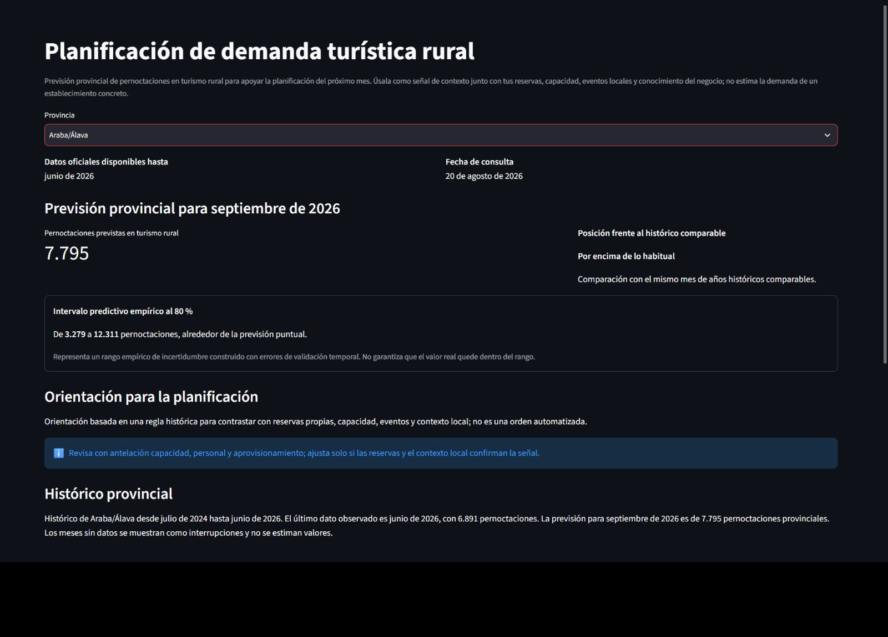

# Entrega 5 - Diseño del frontal y experiencia de usuario del producto

## Trazabilidad de la entrega

Esta entrega convierte el trabajo de datos y modelado de las entregas 1 a 4 en
un producto consultable. No sustituye su trazabilidad: la definición del
problema, las fuentes, el modelo de datos y la evaluación histórica permanecen
documentados en sus entregas respectivas. El punto de partida técnico del
frontal es el cierre B5 del repositorio, cuyo commit es
`47392b481eec052e48adcbabd2bbf8e6bbea37f2`.

La implementación examinada está en `app.py` y
`src/visualization/streamlit_app.py`. Consume el contexto operacional de B5 y
la evidencia canónica congelada en
`data/model_outputs/ets_v2_rolling_validation_predictions.parquet`, sin
recalcular el experimento durante la interacción del usuario.

## 1. Resumen de la solución y del usuario

### 1.1. Problema que resuelve

Las estadísticas oficiales de turismo rural contienen información útil, pero
su formato y dispersión temporal dificultan convertirlas con rapidez en una
señal de planificación provincial. Una persona responsable de un alojamiento,
una actividad turística o una entidad territorial necesita saber qué nivel de
pernoctaciones cabe esperar el mes siguiente, cuánto puede variar esa cifra y
si el resultado está por encima o por debajo de lo habitual para esa provincia
y ese mes del año.

El producto reduce esa fricción: reúne histórico, pronóstico, incertidumbre y
una orientación operativa en una misma consulta. Su ámbito es agregado y
provincial. No pronostica reservas, ingresos, beneficio ni demanda de un
establecimiento concreto.

### 1.2. Usuario principal

El usuario principal es la persona que gestiona o apoya decisiones mensuales
en una microempresa o ecosistema de turismo rural: responsable de alojamiento,
restauración, comercio, actividades, transporte o promoción territorial. Se
presupone conocimiento del negocio, pero no de estadística ni de ingeniería de
machine learning.

### 1.3. Necesidad y decisión concreta

La tarea principal es seleccionar una provincia y obtener una referencia para
el mes siguiente con la que anticipar capacidad, turnos, aprovisionamiento,
promoción o coordinación con proveedores. El frontal no automatiza esas
decisiones: ofrece una señal explicada y permite que el usuario conserve el
control.

### 1.4. Tipo de producto

El MVP es una aplicación operativa de apoyo a la planificación, construida con
Streamlit y Plotly. Presenta un selector provincial y compone una vista de
lectura progresiva:

1. disponibilidad y fecha de consulta;
2. mes objetivo y pronóstico puntual;
3. intervalo empírico operacional del 80 %;
4. posición frente a la historia comparable;
5. orientación de planificación;
6. histórico y evidencia secundaria del modelo.

### 1.5. Resultado y acción principal

El resultado principal es una referencia mensual contextualizada. La acción
posterior es contrastar conjuntamente el punto, el intervalo y la posición
histórica con las reservas propias, la capacidad, el personal, el
aprovisionamiento, las campañas y los eventos o el contexto local antes de
decidir. Ninguna señal debe interpretarse de forma aislada.

### 1.6. Alcance territorial y limitaciones

La variable pronosticada son las pernoctaciones mensuales provinciales en
alojamientos de turismo rural. Una provincia no equivale a un establecimiento:
el producto no predice sus reservas, ingresos, facturación ni rentabilidad. El
horizonte implementado es de un mes y no incorpora todavía información interna
del negocio, precios, clima o eventos.

## 2. Imagen mockup del frontal

### 2.1. Pantalla principal

La imagen es una captura del frontal real, no una composición gráfica ajena a
la implementación. Representa una consulta de **Araba/Álava** realizada el 20
de agosto de 2026. La aplicación informa de que los datos están disponibles
hasta junio de 2026 y muestra septiembre de 2026 como mes objetivo. El resultado
visible es un pronóstico puntual de 7.795 pernoctaciones, una posición histórica
«Por encima de lo habitual» y un intervalo empírico del 80 % entre 3.279 y
12.311.

El encuadre prioriza la tarea principal: propósito, selector, corte de datos,
mes objetivo, resultado, incertidumbre, contexto y acción recomendada. La vista
real continúa bajo el pliegue con el gráfico Plotly del histórico y el
pronóstico, las métricas provinciales de validación canónica, la metodología y
procedencia desplegables y la descarga CSV. Estos elementos son funcionales,
pero se mantienen en un nivel secundario para no competir con la decisión.

### 2.2. Elementos representados

* **Selector territorial:** limita la consulta a las 50 provincias soportadas.
* **Corte de disponibilidad:** hace visible hasta qué mes llega la información
  realmente utilizable y separa esa fecha de la fecha de consulta.
* **Mes objetivo:** evita confundir el mes observado más reciente con el mes
  pronosticado.
* **Pronóstico puntual:** ofrece la referencia central en pernoctaciones.
* **Intervalo empírico operacional:** comunica un rango de variación útil para
  planificar con prudencia.
* **Posición histórica:** compara el punto mediante Q25, Q75 y percentil con el
  comportamiento histórico de la provincia para el mismo mes del año.
* **Orientación operativa:** traduce las señales disponibles a una pauta
  determinista y trazable, sin generar una decisión automática.
* **Historia y gráfico:** permiten revisar el patrón temporal que contextualiza
  la cifra principal.
* **Evidencia y procedencia:** exponen métricas, método, fecha de corte y estado
  de la selección cuando el usuario necesita profundizar.
* **Descarga:** permite obtener el contexto de la consulta en CSV.

### 2.3. Estados excepcionales y mensajes

El diseño contempla que una cifra no siempre esté disponible. Si la fuente
oficial aún no ha publicado el dato requerido por ETS, el sistema puede usar
`lag_12` exclusivamente como fallback de disponibilidad (`availability_only`)
y lo identifica como tal; no existe un router competitivo entre modelos. Si el
intervalo no puede calcularse, el pronóstico puntual puede seguir mostrándose con un aviso no
bloqueante. La historia insuficiente, un artefacto inválido o la imposibilidad
de producir el pronóstico generan mensajes controlados. No se realiza un cambio
silencioso de modelo ni se oculta el origen de la salida.

## 3. Justificación del diseño

### 3.1. Utilidad y valor

La interfaz responde a cuatro preguntas en el orden en que aparecen al
planificar: «¿qué territorio estoy mirando?», «¿para cuándo es la señal?»,
«¿qué nivel se espera y cuánto podría variar?» y «¿qué implica respecto de lo
habitual?». Esta secuencia evita que el usuario tenga que consolidar
manualmente varias tablas y repetir comparaciones estacionales.

La información primaria es el bloque de pronóstico, incertidumbre y contexto.
La información secundaria —métricas, procedencia, detalles metodológicos y
descarga— permanece accesible sin imponer terminología técnica al recorrido
principal. La propuesta de valor no es producir una cifra aislada, sino hacerla
accionable y auditable. Esto ahorra el tiempo de consolidación y comparación
repetitiva, y reduce el riesgo de confundir una estimación provincial con una
previsión del negocio o un rango empírico con una certeza.

### 3.2. Flujo de usuario

El flujo normal es deliberadamente corto:

1. entrar en la aplicación y leer su propósito y alcance;
2. seleccionar una provincia;
3. dejar que la aplicación cargue y valide los recursos canónicos;
4. obtener la inferencia point-in-time para el corte disponible;
5. leer el mes objetivo y el pronóstico puntual;
6. revisar el intervalo empírico operacional del 80 %;
7. interpretar la posición histórica;
8. contrastar la orientación de planificación;
9. explorar el histórico, las métricas y la procedencia si necesita detalle;
10. descargar el contexto si quiere conservarlo o compartirlo;
11. contrastar la señal con datos del negocio y el contexto local antes de
    tomar una decisión externa al sistema.

En los flujos excepcionales, un aviso explica la falta de intervalo, el uso de
`lag_12` por disponibilidad o la imposibilidad de calcular la salida. El usuario
puede cambiar de territorio y reintentar sin perder el contexto general.

### 3.3. Experiencia de usuario

* **Jerarquía:** una única columna narrativa sitúa primero la selección y el
  resultado y después el detalle analítico.
* **Simplicidad:** el único input necesario es la provincia; las fechas se
  derivan del corte point-in-time disponible.
* **Legibilidad:** unidades, meses y etiquetas semánticas acompañan a las cifras
  para evitar lecturas ambiguas.
* **Consistencia:** el mismo territorio y corte gobiernan todos los bloques de
  la vista.
* **Feedback:** los avisos distinguen ausencia de intervalo, fallback y error
  bloqueante.
* **Control:** la orientación es informativa; la decisión empresarial sigue en
  manos del usuario.
* **Accesibilidad práctica:** la información clave no depende únicamente del
  color y aparece también como texto y valores. La interfaz se adapta al ancho
  disponible mediante los componentes nativos de Streamlit, aunque no se ha
  realizado todavía una auditoría formal de conformidad WCAG.

## 4. Presentación de resultados y explicabilidad

### 4.1. Cuatro conceptos que no deben confundirse

1. **Pronóstico puntual:** estimación central de pernoctaciones para una
   provincia y un mes objetivo. No es un dato observado ni una garantía.
2. **Intervalo empírico operacional del 80 %:** rango calibrado con errores
   prequentiales fuera de muestra disponibles antes de cada predicción. Expresa
   incertidumbre operacional; no garantiza que toda provincia o temporada
   alcance individualmente esa cobertura. Su método implementado es
   `operational_prequential_scaled_absolute_residual_interval_v1` y se calibra
   con residuos de la validación rolling disponibles prequentialmente.
3. **Posición histórica:** clasificación del punto frente a los cuantiles 25 y
   75 de los valores históricos de esa provincia para el mismo mes del año. No
   mide la probabilidad de que el pronóstico se cumpla.
4. **Orientación operativa:** regla determinista que combina señales para
   proponer cautela, preparación o seguimiento. No es una predicción adicional,
   una explicación causal ni una recomendación generada libremente.

### 4.2. Nivel visible y detalle secundario

El nivel visible utiliza lenguaje de negocio: territorio, disponibilidad, mes
objetivo, pernoctaciones, rango, comparación histórica y pauta de planificación.
El detalle secundario aporta métricas provinciales, procedencia, modelo usado,
estado de selección y notas metodológicas. La separación permite una lectura
rápida sin sacrificar trazabilidad para quien quiera auditarla.

### 4.3. Evidencia del modelo y limitaciones

La selección operacional es ETS
(`holt_winters_additive_damped_v1`) con estado
`provisional_validation_champion`. Se apoya en validación temporal rolling
point-in-time congelada (`canonical_rolling_validation`) y gana la regla de
selección en dos de los tres folds. Esa variabilidad entre ventanas obliga a
presentarlo como campeón provisional, no como modelo definitivamente
confirmado.

No existe una nueva ventana final intacta e independiente para confirmar la
selección (`independent_final_test = false`). La evaluación usa el último
vintage revisado disponible y métricas pooled que agregan territorios; por ello
no deben interpretarse como una garantía probabilística independiente para
cada provincia. El alcance sigue siendo mensual y provincial.

Evidencia canónica rolling agregada:

| Métrica | Valor |
|---|---:|
| MAE | 4.084,574535196216 |
| RMSE | 7.770,827125343509 |
| WAPE | 19,68924738072576 % |
| Sesgo medio | -1.862,1237643616084 |

Estas métricas describen el experimento de validación canónica; no proceden de
una nueva evaluación final independiente. El sesgo negativo indica
infraestimación media en el conjunto agregado y refuerza la necesidad de leer
el intervalo y el contexto junto al punto.

### 4.4. Modelo seleccionado, modelo usado y fallback

ETS es el modelo seleccionado provisionalmente y el usado cuando sus inputs
están disponibles en el corte de consulta. `seasonal_naive_lag_12` solo
sustituye la salida cuando falta la disponibilidad necesaria para ETS. El frontal expone qué modelo
produjo el resultado. No elige dinámicamente el que parezca más favorable ni
presenta el fallback como un segundo campeón.

### 4.5. Decisión sobre inteligencia artificial generativa

El MVP **no utiliza inteligencia artificial generativa**. La interpretación se
construye con reglas deterministas, cuantiles históricos y metadatos del
experimento, porque así cada texto visible es reproducible, auditable y
consistente con la evidencia. En esta fase no aporta valor suficiente para
justificar su complejidad ni el riesgo de inventar causas o desplazar al modelo
analítico. Una capa generativa futura solo tendría sentido con plantillas
acotadas, grounding en los mismos datos, validación de salidas y
una señal inequívoca de que no sustituye la decisión profesional.

## 5. Alcance del MVP

### 5.1. Implementado y funcional

* aplicación Streamlit ejecutable desde `app.py`;
* visualización Plotly integrada;
* consulta de las 50 provincias;
* corte point-in-time y horizonte mensual de un paso;
* inferencia ETS y fallback `seasonal_naive_lag_12` solo por disponibilidad;
* intervalo empírico operacional del 80 %;
* posición histórica y percentil basados en Q25/Q75 mediante la regla
  `seasonal_q25_q75_last_10_final_non_covid_v1`;
* orientación de decisión determinista;
* métricas territoriales derivadas de la evidencia canónica;
* estados de aviso y error controlados y validación fail-closed de recursos;
* caché de cargas y descarga del contexto en CSV;
* pruebas automatizadas y smoke test de la aplicación.

### 5.2. Fuera de alcance o futuro

* predicción de reservas, ingresos o rentabilidad de una empresa concreta;
* consulta multiprovincia simultánea;
* horizonte multiperiodo y escenarios interactivos what-if;
* integración de precios, gasto, clima, eventos o datos internos del negocio;
* optimización de precios o recomendación personalizada basada en el negocio;
* recomendación prescriptiva automática;
* autenticación, perfiles, persistencia de preferencias y API externa;
* confirmación en una nueva ventana final intacta e independiente;
* garantía de cobertura condicional por provincia y temporada;
* auditoría formal de accesibilidad y despliegue productivo multiusuario;
* aplicación móvil nativa;
* generación de explicaciones mediante inteligencia artificial generativa.

### 5.3. Realismo técnico y reproducibilidad

El frontal reutiliza servicios de aplicación, inferencia y visualización ya
probados; no replica la lógica científica dentro de la capa de presentación.
Los artefactos canónicos permanecen congelados y se verifican por hash. La
aplicación falla de forma controlada ante metadatos o artefactos incoherentes,
y el repositorio fija dependencias y pruebas para reproducir el MVP. Con ello,
la entrega demuestra un producto funcional y trazable, a la vez que declara de
forma explícita lo que todavía no valida.
